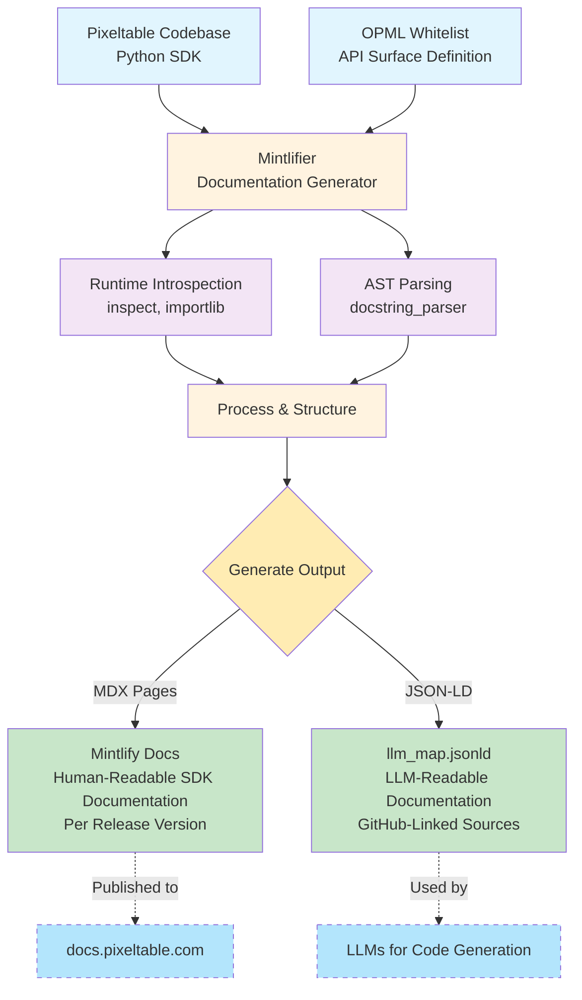

# Documentation Generation Flow

## Overview
This diagram shows how Pixeltable's codebase is transformed into both human-readable and LLM-readable documentation through the Mintlifier system.

## Flow Diagram

## Process Description

### Input Layer
- **Pixeltable Codebase**: The Python SDK source code
- **OPML Whitelist**: Defines which APIs to document (constrains the surface area)

### Processing Layer (Mintlifier)
1. **Runtime Introspection**: Uses Python's `inspect` and `importlib` to examine live objects
2. **AST Parsing**: Uses `docstring_parser` to extract structured documentation
3. **Process & Structure**: Combines runtime and static information

### Output Layer (T-Branch)
The processed information branches into two outputs:

#### Human-Readable Documentation
- **Format**: MDX files with YAML frontmatter
- **Platform**: Mintlify
- **Features**: Navigation, search, versioning
- **Audience**: Developers using the SDK

#### LLM-Readable Documentation  
- **Format**: JSON-LD structured data
- **Features**: GitHub source links, semantic types
- **Audience**: LLMs for code generation and assistance

## Key Components

### Mintlifier Components
- `page_module.py` - Module documentation
- `page_class.py` - Class documentation  
- `page_function.py` - Function documentation
- `page_method.py` - Method documentation
- `page_llmmap.py` - JSON-LD generation

### Output Characteristics

**Mintlify Docs**
- Hierarchical navigation (mod|, class| prefixes)
- Consistent icons (circle-m, square-c, etc.)
- Version dropdown for releases
- GitHub source links

**LLM Map (JSON-LD)**
- Stable `pxt:` identifiers
- Complete signatures with types
- Category inference
- ~400KB flattened size