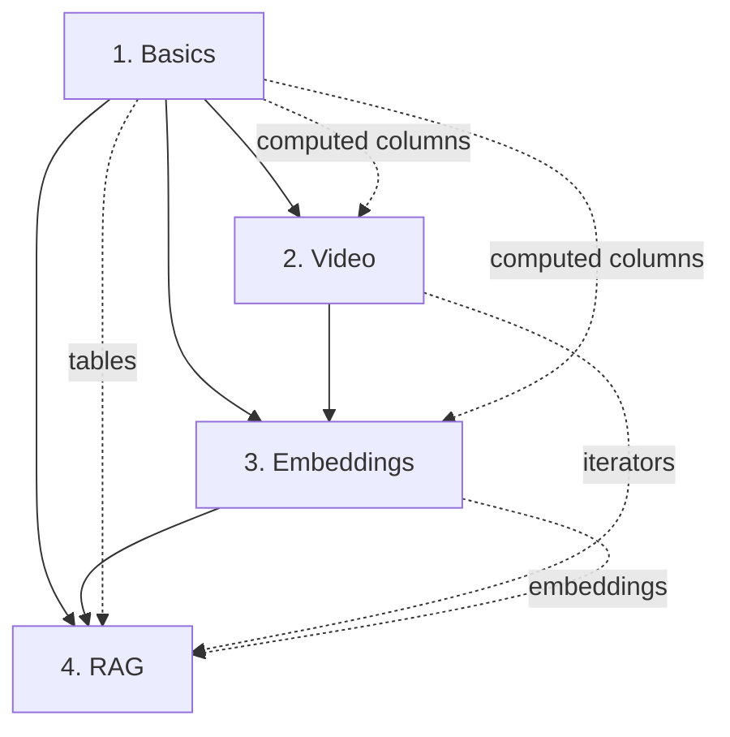

# Pattern Convergence Analysis: After 4 Notebooks

## Emerging Patterns Across All Notebooks

### Core Pixeltable Patterns (Frequency)

1. **Setup → Insert → Transform → Query** (4/4 notebooks)
   - Every notebook follows this flow
   - Setup: create_dir, create_table
   - Insert: URLs or data
   - Transform: computed columns or views  
   - Query: select().show()

2. **Lazy Evaluation + Incremental Updates** (4/4 notebooks)
   - Computed columns backfill existing data
   - Views update automatically on insert
   - Expressions evaluate only when accessed

3. **Type-Specific Columns** (4/4 notebooks)
   - pxt.Image (notebooks 1, 2)
   - pxt.Video (notebook 2)
   - pxt.Document (notebook 4)
   - pxt.String (notebook 3)
   - Each type has specific capabilities

4. **Multimodal Capability** (3/4 notebooks)
   - CLIP appears in notebooks 3 and 4
   - Vision + text processing in notebook 1
   - Cross-modal search emerging as key pattern

### View Patterns

1. **Component Views** (2/4 notebooks)
   - FrameIterator for videos → frames
   - DocumentSplitter for documents → chunks
   - One-to-many transformation pattern

2. **Multiple Views on Same Table** (2/4 notebooks)
   - Different chunking strategies (notebook 4)
   - Different frame rates (implied in notebook 2)
   - A/B testing pattern emerging

### Embedding Patterns

1. **Embedding Indexes vs Computed Columns** (2/4 notebooks)
   - Indexes for similarity search (notebook 3)
   - Computed columns for storage (notebook 4)
   - Choice depends on use case

2. **Multiple Embeddings** (2/4 notebooks)
   - Compare models (notebooks 3, 4)
   - Different dimensions (384, 512, 768)
   - Named indexes for disambiguation

### Performance Patterns

1. **GPU vs CPU Differences** (2/4 notebooks)
   - Video processing: 10x faster on GPU
   - Embeddings: 2-3x faster on GPU
   - Always mentioned in performance_notes

2. **Caching Patterns** (3/4 notebooks)
   - Model caching after first download
   - URL content caching
   - Computed column result storage

## Pattern Saturation Analysis

### Fully Saturated Patterns (seen in all variations)
- Table creation with schema
- Computed columns with functions
- Insert from URLs
- Select with show()

### Partially Saturated (more variations exist)
- Iterator types (only seen 2 of many)
- Embedding models (seen 4-5 of dozens)
- Document types (HTML shown, PDF mentioned)
- Index metrics (cosine shown, L2 and IP mentioned)

### Unexplored Patterns (mentioned but not shown)
- Updates and deletes
- Joins between tables
- Stored procedures/UDFs with batching
- S3 integration
- Time-based operations

## Quality Metrics After 4 Notebooks

| Metric | Notebook 1 | Notebook 2 | Notebook 3 | Notebook 4 |
|--------|------------|------------|------------|------------|
| Lines of JSONLD | 136 | 487 | 438 | 396 |
| Steps | 9 | 13 | 13 | 14 |
| Patterns | 3 | 4 | 4 | 4 |
| Gotchas | 9 | 16 | 14 | 11 |
| Test Questions | 6 | 7 | 7 | 7 |
| Actual Output % | 70% | 85% | 80% | 90% |

## Cross-Notebook Relationships



## Convergence Indicators

### Signs of Convergence
1. **Pattern Repetition**: Same patterns appearing with minor variations
2. **Consistent Structure**: All notebooks follow similar progression
3. **Predictable Gotchas**: Type mismatches, first-run downloads, performance
4. **Stable Categories**: Categories stabilizing around 5-6 core concepts

### Signs of Continued Learning
1. **New Iterator Types**: Each notebook reveals new iterators
2. **Integration Patterns**: Combinations not yet seen (video + embeddings)
3. **Advanced Features**: Mentioned but not demonstrated
4. **Production Patterns**: Optimization strategies emerging slowly

## Predicted Convergence Point

Based on current rate:
- **Pattern Saturation**: ~8-10 notebooks (75% complete)
- **Gotcha Coverage**: ~12-15 notebooks (90% complete)
- **Full Feature Coverage**: ~20-25 notebooks (near impossible)

## Insights for v002 Prompt

### Must Add
1. **Pattern Frequency Tracking**
   ```json
   "pattern_frequency": 4,  // Seen in N notebooks
   "first_seen_in": "01_pixeltable_basics"
   ```

2. **Relationship Tracking**
   ```json
   "builds_on": ["computed_columns", "table_creation"],
   "enables": ["similarity_search", "rag_pipeline"]
   ```

3. **Convergence Indicators**
   ```json
   "novelty_score": 0.3,  // How much new vs repeated
   "pattern_maturity": "emerging|established|saturated"
   ```

4. **Cross-Reference Links**
   ```json
   "see_also": ["03_embeddings#step-7", "04_rag#pattern-2"],
   "contrasts_with": ["indexes_vs_columns"]
   ```

## The Meta Pattern

**Documentation itself follows patterns:**

1. **Introduction Pattern**: Problem → Solution → Code → Result
2. **Complexity Progression**: Simple → Advanced → Production
3. **Error Learning**: Show working → Show common errors → Show fixes
4. **Comparison Pattern**: Method A → Method B → When to use each

## Recommendation

After 4 notebooks, we have enough data to:
1. ✅ Create a robust v002 prompt
2. ✅ Identify core patterns
3. ✅ Predict common gotchas
4. ⚠️ Need 3-4 more for edge cases
5. ⚠️ Need production notebooks for optimization patterns

## Next Notebook Selection

To maximize learning, choose notebooks that:
1. Combine video + embeddings (unseen combination)
2. Show production optimizations (caching, batching)
3. Demonstrate updates/deletes (CRUD completion)
4. Include error handling patterns

🍪 *Patterns are like cookie cutters - once you have the shapes, you can make infinite cookies*