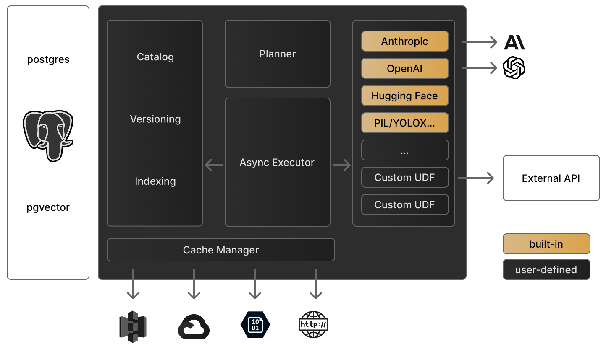

<Tip>
  Use Pixeltable directly in Google Colab: [Pixeltable Basics Tutorial](https://colab.research.google.com/github/pixeltable/pixeltable/blob/release/docs/notebooks/pixeltable-basics.ipynb).
</Tip>

## Local Pixeltable Runtime


## System Requirements

Before installing, ensure your system meets these requirements:

- Python 3.9 or higher
- Linux, MacOs, or Windows

<Tabs>
  <Tab title="Python venv">
    <Steps>
      <Step title="Create virtual environment">
        ```bash
        python -m venv venv
        ```
        This creates an isolated Python environment for your Pixeltable installation.
      </Step>
      <Step title="Activate environment">
        <CodeGroup>
          ```bash Windows
          venv\Scripts\activate
          ```
          ```bash Linux/MacOS
          source venv/bin/activate
          ```
        </CodeGroup>
      </Step>
      <Step title="Install Pixeltable">
        ```bash
        pip install pixeltable
        ```
      </Step>
    </Steps>
  </Tab>
  <Tab title="Conda/Miniconda">
    <Steps>
      <Step title="Install Miniconda">
        Download and install from [Miniconda Installation Guide](https://docs.anaconda.com/free/miniconda/miniconda-install/)
      </Step>
      <Step title="Create environment">
        ```bash
        conda create --name pxt python=3.11
        conda activate pxt
        ```
      </Step>
      <Step title="Install Pixeltable">
        ```bash
        pip install pixeltable
        ```
      </Step>
    </Steps>
  </Tab>
</Tabs>

## Notebooks

<Steps>
  <Step title="Install Jupyter">
    If not already installed:
    ```bash
    pip install jupyter
    ```
  </Step>
  <Step title="Start Jupyter server">
    ```bash
    jupyter notebook
    ```
  </Step>
  <Step title="Create notebook">
    Select "Python 3 (ipykernel)" as the kernel via File / New / Notebook
  </Step>
  <Step title="Test installation">
    ```python
    import pixeltable as pxt
    pxt.init()
    ```
  </Step>
</Steps>

<Warning>
  Wait a minute for Pixeltable to load. You should see a message once connected to the database.
</Warning>

---

### Configuration Options
Pixeltable can be configured through:
- Environment variables
- System configuration file (`~/.pixeltable/config.toml` on Linux/macOS or `C:\Users\<username>\.pixeltable\config.toml` on Windows)

Example `config.toml`:
```toml
[pixeltable]
file_cache_size_g = 250
time_zone = "America/Los_Angeles"
hide_warnings = true
verbosity = 2

[openai]
api_key = 'my-openai-api-key'

[label_studio]
url = 'http://localhost:8080/'
api_key = 'my-label-studio-api-key'
```

### System Settings

| Environment Variable | Config File | Meaning |
| -------------------- | ----------- | ------- |
| PIXELTABLE_HOME | | (string) Pixeltable user directory; default is ~/.pixeltable |
| PIXELTABLE_CONFIG | | (string) Pixeltable config file; default is $PIXELTABLE_HOME/config.toml |
| PIXELTABLE_PGDATA | | (string) Directory where Pixeltable DB is stored; default is $PIXELTABLE_HOME/pgdata |
| PIXELTABLE_DB | | (string) Pixeltable database name; default is pixeltable |
| PIXELTABLE_FILE_CACHE_SIZE_G | [pixeltable]<br/>file_cache_size_g | (float) Maximum size of the Pixeltable file cache, in GiB; required |
| PIXELTABLE_TIME_ZONE | [pixeltable]<br/>time_zone | (string) Default time zone in [IANA format](https://en.wikipedia.org/wiki/List_of_tz_database_time_zones); defaults to the system time zone |
| PIXELTABLE_HIDE_WARNINGS | [pixeltable]<br/>hide_warnings | (bool) Suppress warnings generated by various libraries used by Pixeltable; default is false |
| PIXELTABLE_VERBOSITY | [pixeltable]<br/>verbosity | (int) Verbosity for Pixeltable console logging (0: minimum, 1: normal, 2: maximum); default is 1 |

### API Configuration

| Environment Variable | Config File | Meaning |
| -------------------- | ----------- | ------- |
| ANTHROPIC_API_KEY | [anthropic]<br/>api_key | (string) API key to use for Anthropic services |
| DEEPSEEK_API_KEY | [deepseek]<br/>api_key | (string) API key to use for Deepseek services |
| FIREWORKS_API_KEY | [fireworks]<br/>api_key | (string) API key to use for Fireworks AI services |
| GEMINI_API_KEY | [gemini]<br/>api_key | (string) API key to use for Google Gemini services |
| LABEL_STUDIO_API_KEY | [label_studio]<br/>api_key | (string) API key to use for Label Studio |
| LABEL_STUDIO_URL | [label_studio]<br/>url | (string) URL of the Label Studio server to use |
| MISTRAL_API_KEY | [mistral]<br/>api_key | (string) API key to use for Mistral AI services |
| OPENAI_API_KEY | [openai]<br/>api_key | (string) API key to use for OpenAI services |
| REPLICATE_API_TOKEN | [replicate]<br/>api_token | (string) API token to use for Replicate services |
| TOGETHER_API_KEY | [together]<br/>api_key | (string) API key to use for Together AI services |


## Troubleshooting

Common installation issues and solutions:

<AccordionGroup>
  <Accordion title="Package conflicts">
    If you encounter package conflicts:
    ```bash
    pip install --upgrade pip
    pip cache purge
    pip install -U pixeltable --no-cache-dir
    ```
  </Accordion>
  
  <Accordion title="Database connection issues">
    If Pixeltable fails to initialize:
    1. First, restart your Python session or kernel
    2. Then try initializing again:
    ```python
    import pixeltable as pxt
    pxt.init()
    ```
  </Accordion>
  
  <Accordion title="GPU support">
    1. Install [pytorch](https://pytorch.org/get-started/locally/)
    2. Pixeltable will automatically use GPU once torch is installed.
  </Accordion>
</AccordionGroup>

## Next Steps

<CardGroup cols={2}>
  <Card title="Quick Start Tutorial" icon="play" href="/docs/overview/quick-start">
    Build your first AI application with Pixeltable
  </Card>
  <Card title="Example Gallery" icon="images" href="/docs/resources/sample-apps">
    Explore example applications and use cases
  </Card>
</CardGroup>

## Getting Help

- 💬 Join our [Discord Community](https://discord.gg/pixeltable)
- 🐛 Report issues on [GitHub](https://github.com/pixeltable/pixeltable/issues)
- 📧 Contact [support@pixeltable.com](mailto:support@pixeltable.com)

<RequestExample>
```python Multimodal Search
import pixeltable as pxt
from pixeltable.functions.huggingface import clip
from pixeltable.iterators import FrameIterator
import PIL.Image

video_table = pxt.create_table('videos', {'video': pxt.Video})

video_table.insert([{'video': '/video.mp4'}])

frames_view = pxt.create_view(
    'frames', video_table, iterator=FrameIterator.create(video=video_table.video))

# Create an index on the 'frame' column that allows text and image search
frames_view.add_embedding_index('frame', embedding=clip.using('openai/clip-vit-base-patch32'))

# Now we will retrieve images based on a sample image
sample_image = '/image.jpeg'
sim = frames_view.frame.similarity(sample_image)
frames_view.order_by(sim, asc=False).limit(5).select(frames_view.frame, sim=sim).collect()

# Now we will retrieve images based on a string
sample_text = 'red truck'
sim = frames_view.frame.similarity(sample_text)
frames_view.order_by(sim, asc=False).limit(5).select(frames_view.frame, sim=sim).collect()
```

```python Context-aware Chatbot
import pixeltable as pxt
from datetime import datetime
from typing import List, Dict

# Initialize app structure
pxt.drop_dir("chatbot", force=True)
pxt.create_dir("chatbot")

# Create memory table
memory = pxt.create_table(
    "chatbot.memory",
    {
        "role": pxt.String,
        "content": pxt.String,
        "timestamp": pxt.Timestamp,
    },
    if_exists="ignore",
)

# Create chat session table
chat_session = pxt.create_table(
    "chatbot.chat_session",
    {"user_message": pxt.String, "timestamp": pxt.Timestamp},
    if_exists="ignore",
)

# Define memory retrieval
@pxt.query
def get_recent_memory():
    return (
        memory.order_by(memory.timestamp, asc=False)
        .select(role=memory.role, content=memory.content)
        .limit(10)
    )

# Define message creation
@pxt.udf
def create_messages(past_context: List[Dict], current_message: str) -> List[Dict]:
    messages = [
        {
            "role": "system",
            "content": "You are a chatbot with memory capabilities.",
        }
    ]
    messages.extend(
        [{"role": msg["role"], "content": msg["content"]} for msg in past_context]
    )
    messages.append({"role": "user", "content": current_message})
    return messages

# Configure processing workflow
chat_session.add_computed_column(memory_context=get_recent_memory())
chat_session.add_computed_column(
    prompt=create_messages(chat_session.memory_context, chat_session.user_message)
)
chat_session.add_computed_column(
    llm_response=pxt.functions.openai.chat_completions(
        messages=chat_session.prompt,
        model="gpt-4o-mini"
    )
)
chat_session.add_computed_column(
    assistant_response=chat_session.llm_response.choices[0].message.content
)

```
</RequestExample>