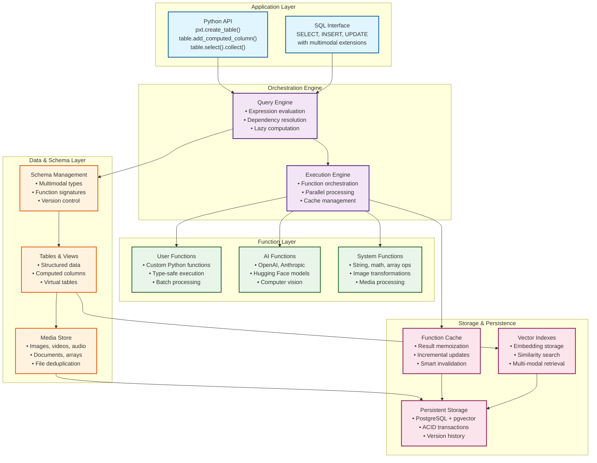
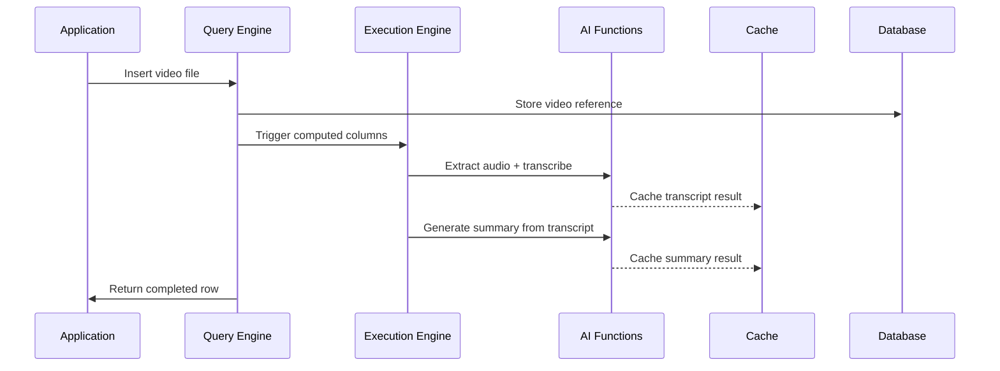
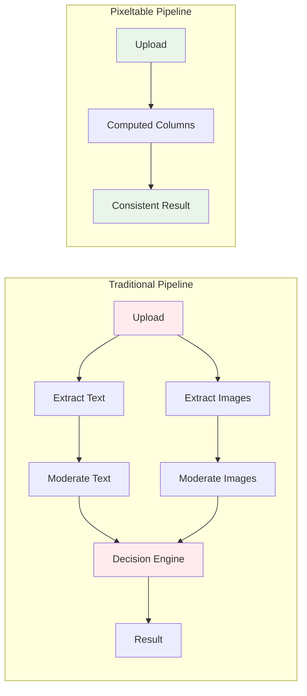

# Understanding Pixeltable

Pixeltable is declarative data infrastructure for multimodal AI apps where tables store not just data, but workflows. Just like databases store and retrieve data, Pixeltable provides incremental storage, transformation, indexing, and orchestration of multimodal data that automatically adapts as your data changes.

## Pixeltable's Solution: Declarative Multimodal Infrastructure

Pixeltable provides a unified multimodal interface, intelligent function orchestration, and automatic dependency management. It makes it easy to build and scale dynamic AI applications with text, images, videos, audio, and documents while you **focus on your application logic, not the infrastructure.**

The following diagram shows the core architecture that Pixeltable enables. We'll start from the bottom and work our way up.

<div style={{textAlign: 'center', margin: '2rem 0'}}>



</div>

## Data & Schema Layer

The data layer is at the core of Pixeltable. Unlike traditional databases that only handle structured data, Pixeltable natively supports multimodal data types and treats functions as first-class citizens.

<Info>
In Pixeltable, your data transformations are not separate scripts or ETL jobs. They're computed columns that live inside your tables and automatically update when source data changes.
</Info>

The Pixeltable data layer provides automatic schema management with support for complex data types. There are no connection strings to manage or infrastructure to provision.

Pixeltable is a "multimodal-relational" database. "Multimodal" means you store images, videos, audio, documents, and embeddings alongside traditional data. "Relational" means you have tables with relationships and can join data across tables using IDs and foreign keys.

The storage layer runs on PostgreSQL with pgvector for embedding support, providing ACID compliance and strong consistency guarantees. All data changes are versioned, and you can revert operations when needed.

```python
import pixeltable as pxt

# Create table with multimodal schema
videos = pxt.create_table('content.videos', {
    'video': pxt.Video,                    # Video file
    'title': pxt.String,                   # Text data
    'embeddings': pxt.Array[(768,), pxt.Float], # Vector data
    'metadata': pxt.Json                   # Structured data
})
```

## Function Layer

When you create a Pixeltable table, you automatically get access to a rich ecosystem of functions for data processing. This is where you define your transformation logic once using **computed columns** - they run automatically on all new and updated data.

Example computed columns that process multimodal data and integrate with AI services:

```python
import pixeltable as pxt
from pixeltable.functions import openai, whisper

# Extract frames from video at 1 FPS
videos.add_computed_column(
    frames=pxt.functions.video.extract_frames(videos.video, fps=1.0)
)

# Transcribe audio track 
videos.add_computed_column(
    transcript=whisper.transcriptions(
        audio=pxt.functions.video.extract_audio(videos.video),
        model='whisper-1'
    )
)

# Generate description using vision model
videos.add_computed_column(
    description=openai.chat_completions(
        model='gpt-4o',
        messages=[{
            'role': 'user', 
            'content': [
                {'type': 'text', 'text': 'Describe this video frame'},
                {'type': 'image_url', 'image_url': {'url': videos.frames[0]}}
            ]
        }]
    )
)
```

You process data through three types of functions:

**User-Defined Functions (UDFs)** are custom Python functions you write. They can be simple transformations or complex AI workflows, and they integrate seamlessly with Pixeltable's type system and caching.

**AI Functions** connect to external AI services like OpenAI, Anthropic, and Hugging Face. These functions handle authentication, rate limiting, and error recovery automatically.

**System Functions** are built-in operations for common data processing tasks like string manipulation, mathematical operations, and media transformations.

<Info>
The entire computed column evaluation is automatically cached and dependency-managed. There are no manual cache invalidation or pipeline orchestration steps to write. Pixeltable automatically determines what needs to be recomputed when data changes.
</Info>

Pixeltable also supports **Tables as UDFs**, allowing you to convert entire data processing workflows into reusable functions. This enables modular AI agent architectures and complex multi-step pipelines.

You can also create **User-Defined Aggregates (UDAs)** for custom aggregation logic, and **MCP UDFs** to integrate with external services through the Model Context Protocol.

## Orchestration Engine

Pixeltable's orchestration engine automatically manages the execution of your data workflows. When you query data or add computed columns, the engine builds a dependency graph and executes functions in the optimal order.

```python
# This creates a dependency graph automatically
videos.add_computed_column(
    summary=openai.chat_completions(
        model='gpt-4o-mini',
        messages=[{
            'role': 'user',
            'content': f'Summarize: {videos.transcript.text}'
        }]
    )
)
```

The query engine tracks dependencies between computed columns. When `videos.transcript` changes, `videos.summary` is automatically marked for recomputation. You don't need to think about execution order or data lineage.

The execution engine provides intelligent caching, parallel processing, and incremental updates. Functions are executed only when their inputs change, and results are cached to avoid redundant computation.

When calling AI functions, the execution engine automatically handles batching for better performance, rate limiting to avoid quota errors, and retry logic for transient failures.

## Application Layer

Pixeltable provides both a Python API and SQL interface for interacting with your data and workflows.

```python
# Python API - natural and expressive
results = videos.where(
    videos.title.contains('tutorial')
).select(
    videos.title,
    videos.summary,
    similarity_score=videos.embeddings.similarity('machine learning')
).order_by(
    'similarity_score', asc=False
).limit(10).collect()
```

Like the `useQuery` hook in React that updates components when state changes, Pixeltable queries automatically reflect the latest computed results. There's no manual refresh or cache invalidation needed.

The Python API also provides DataFrame-style operations that feel familiar to data scientists, while the SQL interface allows integration with existing BI tools and database workflows.

You can create views, iterators for processing large media files, and embedding indexes for semantic search - all through the same unified interface.

## Putting it all together

Let's return to the video processing example and follow what happens when you build a video analysis pipeline:

```python
import pixeltable as pxt
from pixeltable.functions import openai, whisper

# Create video analysis table
videos = pxt.create_table('analysis.videos', {
    'video': pxt.Video,
    'title': pxt.String
})

# Add computed workflow
videos.add_computed_column(
    transcript=whisper.transcriptions(
        audio=pxt.functions.video.extract_audio(videos.video)
    )
)

videos.add_computed_column(
    summary=openai.chat_completions(
        model='gpt-4o-mini',
        messages=[{
            'role': 'user',
            'content': f'Summarize: {videos.transcript.text}'
        }]
    )
)
```

Let's follow what happens when you insert a video:

<div style={{margin: '2rem 0'}}>



</div>

The application inserts a video file, and the following happens automatically:

1. **Storage**: The video file is stored in Pixeltable's media store
2. **Dependency Analysis**: The query engine identifies that `transcript` and `summary` columns need computation
3. **Execution Planning**: The execution engine determines `transcript` must be computed before `summary`
4. **Function Execution**: Audio is extracted, sent to Whisper for transcription, then the transcript is sent to OpenAI for summarization
5. **Caching**: Results are cached so subsequent queries are instant
6. **Return**: The complete row with all computed values is returned

When you later query the data:

```python
# This query returns instantly - all computations are cached
recent_summaries = videos.where(
    videos.title.contains('2024')
).select(
    videos.title,
    videos.summary.choices[0].message.content
).collect()
```

## Beyond data storage

Beyond storing multimodal data, Pixeltable's architecture provides consistency guarantees that traditional AI pipelines lack.

To illustrate this, let's imagine you're building a content moderation system for a social media platform.

<div style={{margin: '2rem 0'}}>



</div>

In the traditional pipeline, you have separate processes for text extraction, image extraction, moderation calls, and decision logic. These can get out of sync, leading to inconsistent moderation decisions.

With Pixeltable, all moderation logic is defined as computed columns that execute transactionally. When a post is uploaded, all moderation steps execute in a consistent state, and the final decision reflects a single point in time across all data.

```python
posts = pxt.create_table('moderation.posts', {
    'content': pxt.String,
    'images': pxt.Array[pxt.Image]
})

# All moderation logic executes consistently
posts.add_computed_column(
    text_flags=moderate_text(posts.content)
)
posts.add_computed_column(
    image_flags=moderate_images(posts.images) 
)
posts.add_computed_column(
    final_decision=combine_decisions(posts.text_flags, posts.image_flags)
)
```

The computed columns ensure that `text_flags`, `image_flags`, and `final_decision` all reflect the same version of the input data. You never have a moment where the text analysis is from an old version while the image analysis is from a new version.

## For AI-first applications

Pixeltable is designed specifically for AI workflows with features that make building with LLMs and multimodal models easier and more reliable:

1. **Multimodal Type System**: Native support for images, videos, audio, documents, and embeddings means you don't need separate storage solutions or complex data pipelines.

2. **Function Orchestration**: AI function calls are automatically batched, cached, and retried. Rate limiting and error handling are built-in, so you can focus on your application logic.

3. **Incremental Computation**: Only recomputes what's necessary when data or code changes, saving time and cost. When you update a document in your RAG system, only the affected chunks and embeddings are regenerated.

4. **Version Control**: Every change is tracked with full lineage. You can revert operations, compare results across versions, and debug issues by examining historical state.

5. **Embedding Indexes**: Built-in vector search with automatic index maintenance. Add semantic search to any column with a single function call.

Together, these features mean you can build sophisticated AI applications with simple, maintainable code while Pixeltable handles the complex orchestration, caching, and consistency challenges in the background.

## Learn more

If you want to understand more about how Pixeltable works under the hood, explore our [technical deep-dives](/docs/examples/fundamentals) and [sample applications](/docs/examples).

Now that you understand how Pixeltable fits into AI application architecture, let's walk through [building your first application](/docs/overview/quick-start). 