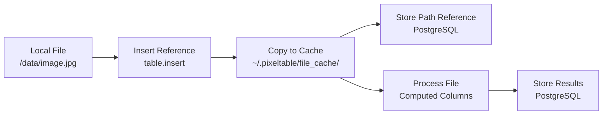
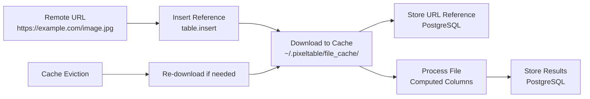
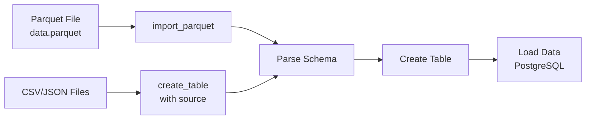

Pixeltable manages media files through a sophisticated caching system that balances performance with storage efficiency. Understanding how files flow through the system is essential for optimizing large-scale media processing workflows.

## File Cache Architecture

Pixeltable maintains a local file cache for all media files referenced in tables. This cache serves as an intermediate layer between your data sources and processing operations.

### Cache Configuration

The file cache size defaults to 1/5 of available disk space but can be configured in `~/.pixeltable/config.toml`:

```toml
[pixeltable]
file_cache_size_g = 100  # Cache size in GB
```

The cache uses LRU (Least Recently Used) eviction. When the cache fills up, the oldest accessed files are removed to make room for new ones.

## Inserting Media from Local Files

When you insert references to local media files, Pixeltable copies them into its managed cache rather than accessing them directly.



### Data Flow

1. **Reference Insertion**: You provide a file path when inserting data
2. **File Copy**: The file is copied to Pixeltable's cache directory
3. **Path Storage**: A reference to the cached copy is stored in PostgreSQL
4. **Processing**: Computed columns access the cached file
5. **Persistence**: The file remains cached until evicted by LRU policy

```python
# Files are copied to cache, not accessed directly
table.insert([
    {'video': '/mnt/storage/video1.mp4'},
    {'video': '/mnt/storage/video2.mp4'}
])
```

### Cache Behavior

- Files are copied on first access, not during insert
- Cached files persist across sessions
- If a file is evicted and needed again, it's re-copied from source
- Original files must remain accessible for re-caching

## Importing from URLs

URL-based media follows a similar pattern but with download instead of copy:



URL references are hashed to create cache keys, ensuring consistent caching across sessions.

## Importing Structured Data

Parquet files and other structured formats bypass the file cache for direct import:



### Structured Import Methods

```python
# Direct import from Parquet
import pixeltable.io as pxt_io
table = pxt_io.import_parquet('data.parquet', 'my_table')

# Create table from CSV with schema inference
table = pxt.create_table('my_table', source='data.csv')
```

Structured data is loaded directly into PostgreSQL without intermediate caching, making it more efficient for large datasets.

## Storage Considerations

### Database Storage

PostgreSQL stores:
- Table schemas and metadata
- Column data for non-media types
- File paths/URLs for media columns
- Computed column results
- Embedding vectors and indexes

### File Cache Storage

The file cache stores:
- Copies of local media files
- Downloaded remote media
- Temporary processing files

### Storage Optimization Strategies

For large-scale deployments, consider:

1. **Separate cache location**: Symlink the cache directory to dedicated storage
   ```bash
   ln -s /mnt/fast-storage/pxt-cache ~/.pixeltable/file_cache
   ```

2. **Tiered storage**: Place PostgreSQL on SSD, file cache on HDD
3. **Cache size tuning**: Balance between re-download overhead and storage cost
4. **External object storage**: Use S3/GCS URLs instead of local files for massive datasets

## Performance Implications

The caching architecture has several performance implications:

- **First access latency**: Initial file copies/downloads can be slow
- **Cache thrashing**: Undersized caches cause repeated re-fetching
- **I/O overhead**: Local files are copied rather than referenced
- **Network costs**: Evicted URL-based files must be re-downloaded

Monitor cache hit rates and eviction warnings to optimize cache sizing:

```python
from pixeltable.utils.filecache import FileCache
stats = FileCache.get().stats()
print(f"Cache hit rate: {stats.num_hits / stats.num_requests:.2%}")
```

Understanding these mechanics helps design efficient media processing pipelines that minimize unnecessary I/O and maximize cache effectiveness.