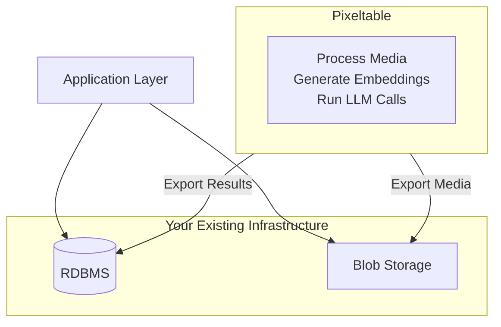
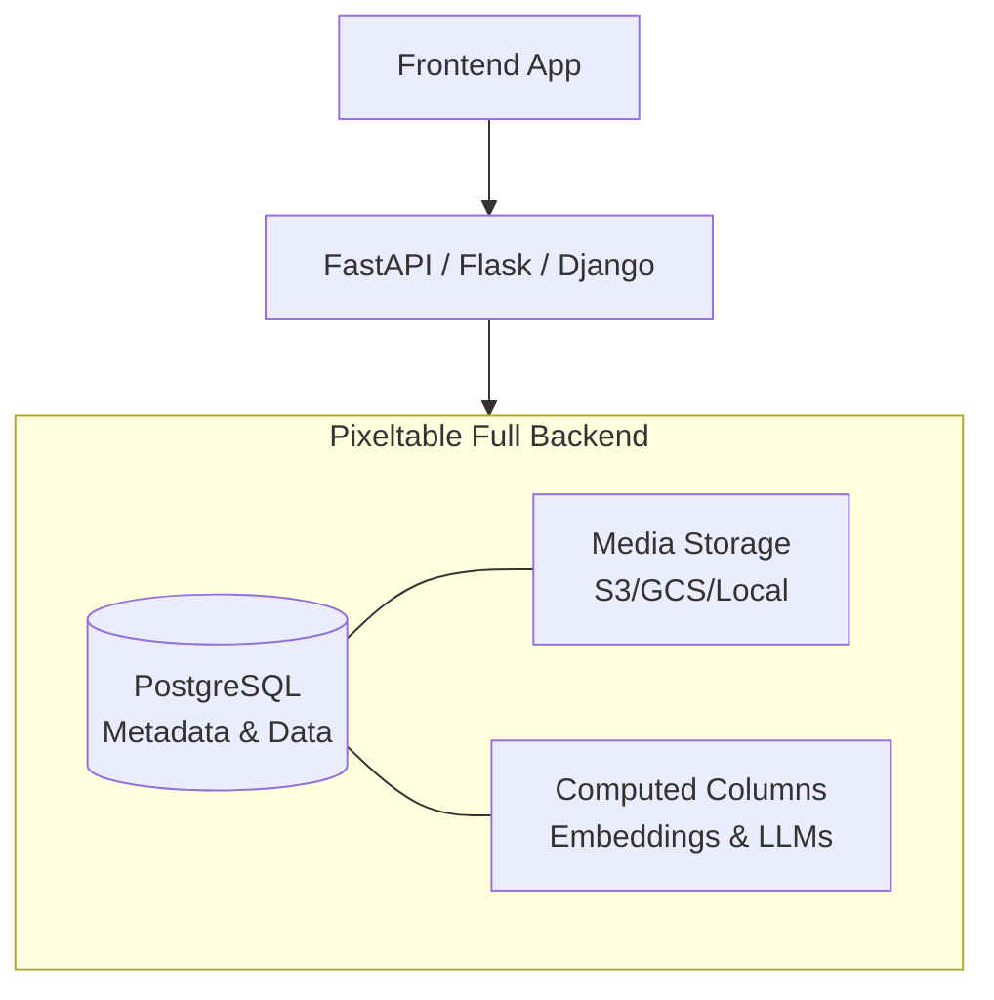
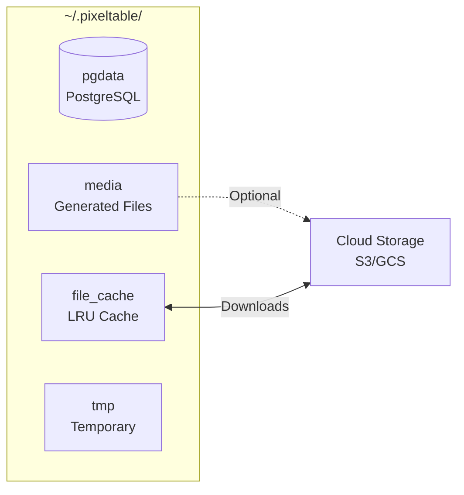

## Deployment Decision Guide

Pixeltable supports two production deployment patterns. Choose based on your constraints:

| Question | Answer | Recommendation |
|----------|--------|----------------|
| Existing production DB that must stay? | Yes | **Orchestration Layer** |
| Building new multimodal app? | Yes | **Full Backend** |
| Need semantic search (RAG)? | Yes | **Full Backend** |
| Only ETL/transformation? | Yes | **Orchestration Layer** |
| Expose Pixeltable as MCP server for LLM tools? | Yes | **Full Backend** + [MCP Server](/libraries/mcp) |


### Technical Capabilities (Both)

Regardless of deployment mode, you get:
- **[Multimodal Types](/datastore/bringing-data):** Native handling of Video, Document, Audio, Image, JSON.
- **[Computed Columns](/datastore/computed-columns):** Automatic incremental updates and dependency tracking.
- **[Views & Iterators](/datastore/views):** Built-in logic for chunking documents, extracting frames, etc.
- **[Model Orchestration](/integrations/frameworks):** Rate-limited API calls to OpenAI, Anthropic, Gemini, local models.
- **[Data Interoperability](/sdk/latest/io):** Import/export Parquet, PyTorch, LanceDB, pandas.
- **[Configurable Media Storage](/overview/configuration):** Per-column destination (local or cloud bucket).

---

## Deployment Strategies

### Approach 1: Pixeltable as Orchestration Layer

Use Pixeltable for multimodal data orchestration while retaining your existing data infrastructure.



<AccordionGroup>
  <Accordion title="Use When" icon="check">
    - Existing RDBMS (PostgreSQL, MySQL) and blob storage (S3, GCS, Azure Blob) must remain
    - Application already queries a separate data layer
    - Incremental adoption required with minimal stack changes
  </Accordion>
  
  <Accordion title="Architecture" icon="sitemap">
    - Deploy Pixeltable in Docker container or dedicated compute instance
    - Define tables, views, computed columns, and UDFs for multimodal processing
    - Process videos, documents, audio, images within Pixeltable
    - Export structured outputs (embeddings, metadata, classifications) to RDBMS
    - Export generated media to blob storage
    - Application queries existing data layer, not Pixeltable
  </Accordion>
  
  <Accordion title="What This Provides" icon="sparkles">
    - Native multimodal type system (Video, Document, Audio, Image, JSON)
    - Declarative computed columns eliminate orchestration boilerplate
    - Incremental computation automatically handles new data
    - UDFs encapsulate transformation logic
    - LLM call orchestration with automatic rate limiting (see [Advanced Features](#advanced-features))
    - Iterators for chunking documents, extracting frames, splitting audio
  </Accordion>
</AccordionGroup>

```python
# Example: Orchestrate in Pixeltable, export to external systems
import pixeltable as pxt
from pixeltable.functions.video import extract_audio
from pixeltable.functions.openai import transcriptions
from pixeltable.iterators import FrameIterator
import psycopg2
from datetime import datetime

# Setup: Define Pixeltable orchestration pipeline
pxt.create_dir('video_processing', if_exists='ignore')

videos = pxt.create_table(
    'video_processing.videos',
    {'video': pxt.Video, 'uploaded_at': pxt.Timestamp}
)

# Computed columns for orchestration
videos.add_computed_column(
    audio=extract_audio(videos.video, format='mp3')
)
videos.add_computed_column(
    transcript=transcriptions(audio=videos.audio, model='whisper-1')
)

# Optional: Add LLM-based summary
from pixeltable.functions.openai import chat_completions
videos.add_computed_column(
    summary=chat_completions(
        messages=[{'role': 'user', 'content': f"Summarize: {videos.transcript.text}"}],
        model='gpt-4o-mini'
    )
)

# Extract frames for analysis
frames = pxt.create_view(
    'video_processing.frames',
    videos,
    iterator=FrameIterator.create(video=videos.video, fps=1.0)
)

# Insert video for processing
videos.insert([{'video': 's3://bucket/video.mp4', 'uploaded_at': datetime.now()}])

# Export structured results to external RDBMS
conn = psycopg2.connect("postgresql://...")
cursor = conn.cursor()

for row in videos.select(videos.video, videos.transcript).collect():
    cursor.execute(
        "INSERT INTO video_metadata (video_url, transcript_json) VALUES (%s, %s)",
        (row['video'], row['transcript'])
    )
conn.commit()
```

### Approach 2: Pixeltable as Full Backend

Use Pixeltable for both orchestration and storage as your primary data backend.



<AccordionGroup>
  <Accordion title="Use When" icon="check">
    - Building new multimodal AI application
    - Semantic search and vector similarity required
    - Storage and ML pipeline need tight integration
    - Stack consolidation preferred over separate storage/orchestration layers
  </Accordion>
  
  <Accordion title="Architecture" icon="sitemap">
    - Deploy Pixeltable on persistent instance (EC2 with EBS, EKS with persistent volumes, VM)
    - Build API endpoints (FastAPI, Flask, Django) that interact with Pixeltable tables
    - Frontend calls endpoints to insert data and retrieve results
    - Query using Pixeltable's semantic search, filters, joins, and aggregations
    - All data stored in Pixeltable: metadata, media references, computed column results
  </Accordion>
  
  <Accordion title="What This Provides" icon="sparkles">
    - Unified storage, computation, and retrieval in single system
    - Native semantic search via embedding indexes (pgvector)
    - No synchronization layer between storage and orchestration
    - Automatic versioning and lineage tracking
    - Incremental computation propagates through views
    - LLM/agent orchestration (see [Advanced Features](#advanced-features))
    - Data export to PyTorch, Parquet, LanceDB (see [Data Interoperability](#data-interoperability))
  </Accordion>
</AccordionGroup>

```python
# Example: FastAPI endpoints backed by Pixeltable
from fastapi import FastAPI, UploadFile
from datetime import datetime
import pixeltable as pxt

app = FastAPI()
docs_table = pxt.get_table('myapp.documents')  # Has computed columns: embedding, summary

@app.post("/documents/upload")
async def upload_document(file: UploadFile):
    status = docs_table.insert([{
        'document': file.filename,
        'uploaded_at': datetime.now()
    }])
    return {"rows_inserted": status.num_rows}

@app.get("/documents/search")
async def search_documents(query: str, limit: int = 10):
    sim = docs_table.embedding.similarity(query)
    results = docs_table.select(
        docs_table.document,
        docs_table.summary,  # LLM-generated summary (computed column)
        similarity=sim
    ).order_by(sim, asc=False).limit(limit).collect()
    
    return {"results": list(results)}

@app.get("/documents/{doc_id}")
async def get_document(doc_id: int):
    result = docs_table.where(docs_table._rowid == doc_id).collect()
    return result[0] if len(result) > 0 else {"error": "Not found"}
```

## Infrastructure Setup

Both deployment strategies require separating schema definition from application code.

### Code Organization

**Schema Definition (`setup_pixeltable.py`):**
- Defines directories, tables, views, computed columns, indexes
- Acts as Infrastructure-as-Code for Pixeltable entities
- Version controlled in Git
- Executed during initial deployment and schema migrations

**Application Code (`app.py`, `endpoints.py`, `functions.py`):**
- Assumes Pixeltable infrastructure exists
- Interacts with tables via `pxt.get_table()` and `@pxt.udf`
- Handles missing tables/views gracefully

**Configuration (`config.py`):**
- Externalizes model IDs, API keys, thresholds, connection strings
- Uses environment variables (`.env` + `python-dotenv`) or secrets management
- Never hardcodes secrets

```python
# setup_pixeltable.py
import pixeltable as pxt
import config

pxt.create_dir(config.APP_NAMESPACE, if_exists='ignore')

    pxt.create_table(
        f'{config.APP_NAMESPACE}.documents',
        {
            'document': pxt.Document,
            'metadata': pxt.Json,
            'timestamp': pxt.Timestamp
        },
    if_exists='ignore'  # Idempotent: safe for repeated execution
)

# ---

# app.py
import pixeltable as pxt
import config

    docs_table = pxt.get_table(f'{config.APP_NAMESPACE}.documents')
    if docs_table is None:
        raise RuntimeError(
        f"Table '{config.APP_NAMESPACE}.documents' not found. "
        "Run setup_pixeltable.py first."
    )
```

### Storage Architecture

Pixeltable is an OLTP database built on embedded PostgreSQL. It uses multiple storage mechanisms:



<Tip>
**Important Concept:** Pixeltable directories (`pxt.create_dir`) are logical namespaces in the catalog, NOT filesystem directories.
</Tip>

**How Media is Stored:**
- PostgreSQL stores only file paths/URLs, never raw media data.
- Inserted local files: path stored, original file remains in place.
- Inserted URLs: URL stored, file downloaded to File Cache on first access.
- Generated media (computed columns): saved to Media Store (default: local, configurable to S3/GCS/Azure per-column).
- File Cache size: configure via `file_cache_size_g` in `~/.pixeltable/config.toml`. [See configuration guide](/overview/configuration)

**Deployment-Specific Storage Patterns:**

*Approach 1 (Orchestration Layer):*
- Pixeltable storage can be ephemeral (re-computable).
- Processing results exported to external RDBMS and blob storage.
- Reference input media from S3/GCS/Azure URIs.

*Approach 2 (Full Backend):*
- Pixeltable IS the RDBMS (embedded PostgreSQL, not replaceable).
- Requires persistent volume at `~/.pixeltable` (pgdata, media, file_cache).
- Media Store configurable to S3/GCS/Azure buckets for generated files.

## Production Considerations

### Concurrent Access & Scaling

| Aspect | Details |
|--------|---------|
| **Locking** | Automatic table-level locking for schema changes |
| **Isolation** | PostgreSQL `SERIALIZABLE` isolation prevents data race conditions |
| **Retries** | Built-in retry logic handles transient serialization failures |
| **Multi-Process** | Multiple workers/containers can safely read/write to the same instance |

| Scaling Dimension | Current Approach | Limitation |
|-------------------|------------------|------------|
| **Metadata Storage** | Single embedded PostgreSQL instance | Vertical scaling (larger EC2/VM) |
| **Compute** | Multiple API workers connected to same instance | Shared access to storage volume required |
| **High Availability** | Single attached storage volume | Failover requires volume detach/reattach |

<Info>
Multi-node HA and horizontal scaling planned for Pixeltable Cloud (2026).
</Info>

### GPU Acceleration

- **Automatic GPU Detection:** Pixeltable uses CUDA GPUs for local models (Hugging Face, Ollama) when available.
- **CPU Fallback:** Models run on CPU if no GPU detected (functional but slower).
- **Configuration:** Control via `CUDA_VISIBLE_DEVICES` environment variable.

### Error Handling

| Error Type | Mode | Behavior |
|------------|------|----------|
| **Computed Column Errors** | `on_error='abort'` (default) | Fails entire operation if any row errors |
| | `on_error='ignore'` | Continues processing; stores `None` with error metadata |
| **Media Validation** | `media_validation='on_write'` (default) | Validates media during insert (catches errors early) |
| | `media_validation='on_read'` | Defers validation until media accessed (faster inserts) |

Access error details via `table.column.errortype` and `table.column.errormsg`.

```python
# Example: Graceful error handling in production
table.add_computed_column(
    analysis=llm_analyze(table.document),
    on_error='ignore'  # Continue processing despite individual failures
)

# Query for errors
errors = table.where(table.analysis.errortype != None).collect()
```

### Schema Evolution

| Operation Type | Examples | Impact |
|----------------|----------|--------|
| **Safe** | Add columns, Add computed columns, Add indexes | Incremental computation only |
| **Destructive** | Modify computed columns (`if_exists='replace'`), Drop columns/tables/views | Full recomputation or data loss |

**Production Safety:**
```python
# Use if_exists='ignore' for idempotent schema migrations
import pixeltable as pxt
import config

docs_table = pxt.get_table(f'{config.APP_NAMESPACE}.documents')
docs_table.add_computed_column(
    embedding=embed_model(docs_table.document),
    if_exists='ignore'  # No-op if column exists
)
```
- Version control `setup_pixeltable.py` like database migration scripts.
- Rollback via `table.revert()` (single operation) or Git revert (complex changes).

### Code Organization

Separate schema definition from application logic to enable testability and safe migrations.

<Tabs>
  <Tab title="Project Structure">
```
project/
├── config.py              # Environment variables, model IDs, API keys
├── functions.py           # Custom UDFs (imported as modules)
├── setup_pixeltable.py    # Schema definition (tables, views, indexes)
├── app.py                 # Application endpoints (FastAPI/Flask)
├── requirements.txt       # Pinned dependencies
└── .env                   # Secrets (gitignored)
```
  </Tab>
  
  <Tab title="config.py">
```python
import os

ENV = os.getenv('ENVIRONMENT', 'dev')
APP_NAMESPACE = f'{ENV}_myapp'

# Model Configuration
EMBEDDING_MODEL = os.getenv('EMBEDDING_MODEL', 'intfloat/e5-large-v2')
OPENAI_MODEL = os.getenv('OPENAI_MODEL', 'gpt-4o-mini')

# Storage
MEDIA_STORAGE_BUCKET = os.getenv('MEDIA_STORAGE_BUCKET')

# Prompts
RAG_SYSTEM_PROMPT = """You are a helpful assistant. Use the provided context to answer questions."""
```
  </Tab>
  
  <Tab title="functions.py">
```python
import pixeltable as pxt

@pxt.udf
def format_prompt(context: list, question: str) -> str:
    """Format RAG prompt with context."""
    context_str = "\n".join([doc['text'] for doc in context])
    return f"Context:\n{context_str}\n\nQuestion: {question}"

@pxt.udf(resource_pool='request-rate:my_service')
async def call_custom_model(prompt: str) -> dict:
    """Call self-hosted model endpoint."""
    # Your custom logic here
    return {"response": "..."}
```
  </Tab>
  
  <Tab title="setup_pixeltable.py">
```python
import pixeltable as pxt
from pixeltable.functions.huggingface import sentence_transformer
import config
from functions import format_prompt  # Import module UDFs

# Create namespace
pxt.create_dir(config.APP_NAMESPACE, if_exists='ignore')

# Define base table
docs = pxt.create_table(
    f'{config.APP_NAMESPACE}.documents',
    {'document': pxt.Document, 'metadata': pxt.Json, 'timestamp': pxt.Timestamp},
    if_exists='ignore'
)

# Add computed columns
docs.add_computed_column(
    embedding=sentence_transformer(docs.document, model_id=config.EMBEDDING_MODEL),
    if_exists='ignore'
)

# Add embedding index for similarity search
docs.add_embedding_index('embedding', metric='cosine', if_not_exists=True)

# Define retrieval query function
@pxt.query
def search_documents(query_text: str, limit: int = 5):
    """RAG retrieval query."""
    sim = docs.embedding.similarity(query_text)
    return docs.order_by(sim, asc=False).limit(limit).select(docs.document, sim)
```
  </Tab>
  
  <Tab title="app.py">
```python
from fastapi import FastAPI
import pixeltable as pxt
from setup_pixeltable import search_documents
import config

app = FastAPI()
docs_table = pxt.get_table(f'{config.APP_NAMESPACE}.documents')

@app.get("/search")
async def search(query: str, limit: int = 5):
    results = search_documents(query, limit).collect()
    return {"results": list(results)}
```
  </Tab>
</Tabs>

<Note>
**Key Principles:**
- **Module UDFs** (`functions.py`): Update when code changes; improve testability. [Learn more](/datastore/custom-functions)
- **Retrieval Queries** (`@pxt.query`): Encapsulate complex retrieval logic as reusable functions.
- **Idempotency:** Use `if_exists='ignore'` to make `setup_pixeltable.py` safely re-runnable. [Learn more](/datastore/tables-and-operations)
</Note>


## Monitoring and Performance

**Logging:**
- Implement Python logging in UDFs and application endpoints
- Track execution time, errors, API call latency
- Use structured logging (JSON) for log aggregation

**Resource Monitoring:**
- Monitor CPU, RAM, Disk I/O, Network on Pixeltable host
- Track UDF execution time and model inference latency
- Alert on resource exhaustion

**Optimization:**
- **Batch Operations:** Use `@pxt.udf(batch_size=32)` for GPU model inference
- **Batch Inserts:** Insert multiple rows at once: `table.insert([row1, row2, ...])`
- **Profile UDFs:** Add execution time logging to identify bottlenecks
- **Embedding Indexes:** pgvector for efficient similarity search. [Learn more](/datastore/vector-database)

**Rate Limiting:**
- **Built-In Providers:** Automatic rate limiting for OpenAI, Anthropic, Gemini, etc. (configured per-model in `config.toml`).
- **Custom APIs:** Use `@pxt.udf(resource_pool='request-rate:my_service')` to throttle calls to self-hosted models or custom endpoints (default: 600 RPM).

```python
# Example: Custom rate-limited UDF for self-hosted model
@pxt.udf(resource_pool='request-rate:my_ray_cluster')
async def call_ray_model(prompt: str, model: str) -> dict:
    # Your logic to call FastAPI + Ray cluster
    return await custom_api_call(prompt, model)
```

```python
import logging
import time
import pixeltable as pxt

logger = logging.getLogger(__name__)

@pxt.udf
def process_video(video: pxt.Video) -> pxt.Json:
    start = time.time()
    try:
        # Your processing logic here
        result = {'processed': True}
        logger.info(f"Processed in {time.time() - start:.2f}s")
        return result
except Exception as e:
        logger.error(f"Processing failed: {e}")
        raise
```

## Deployment Patterns

**Web Applications:**
- Execute `setup_pixeltable.py` during deployment initialization
- Web server processes connect to Pixeltable instance
- Pixeltable uses connection pooling internally
- Example: FastAPI with `pxt.get_table()` in endpoint handlers

**Batch Processing:**
- Schedule via `cron`, Airflow, AWS EventBridge, GCP Cloud Scheduler
- Isolate batch workloads from real-time serving (separate containers/instances)
- Use Pixeltable's incremental computation to process only new data

**Containers:**
- Docker provides reproducible builds across environments
- **Approach 2 (Full Backend):** Mount persistent volume at `~/.pixeltable`
- **Kubernetes:** Use `ReadWriteOnce` PVC (single-pod write access)
- Docker Compose or Kubernetes for multi-container deployments

```dockerfile
# Dockerfile for Pixeltable application
FROM python:3.11-slim

WORKDIR /app
COPY requirements.txt .
RUN pip install --no-cache-dir -r requirements.txt

COPY . .

# Initialize schema and start application
CMD python setup_pixeltable.py && uvicorn app:app --host 0.0.0.0
```

## Environment Management

### Multi-Tenancy and Isolation

| Isolation Type | Implementation | Use Case | Overhead |
|----------------|----------------|----------|----------|
| **Logical** | Single Pixeltable instance with directory namespaces (`pxt.create_dir(f"user_{user_id}")`) | Dev/staging environments, simple multi-user apps | Low |
| **Physical** | Separate container instances per tenant | SaaS with strict data isolation | High |

**Logical Isolation Example:**
```python
# Per-user isolation via namespaces
pxt.create_dir(f"user_{user_id}", if_exists='ignore')
user_table = pxt.create_table(f"user_{user_id}.chat_history", schema={...})
```

### High Availability Constraints

| Configuration | Status | Details |
|---------------|--------|---------|
| **Single Pod + ReadWriteOnce PVC** | ✅ Supported | One active pod writes to dedicated volume. Failover requires volume detach/reattach. |
| **Multiple Pods + Shared Volume (NFS/EFS)** | ❌ Not Supported | **Will cause database corruption.** Do not mount same `pgdata` to multiple pods. |
| **Multi-Node HA** | 🔜 Coming 2026 | Available in Pixeltable Cloud (serverless scaling, API endpoints). [Join waitlist](https://www.pixeltable.com/waitlist) |

<Warning>
**Single-Writer Limitation:** Pixeltable's storage layer uses an embedded PostgreSQL instance. **Only one process can write to `~/.pixeltable/pgdata` at a time**.
</Warning>

### Environment Separation

Use environment-specific namespaces to manage dev/staging/prod configurations:

```python
# config.py
import os

ENV = os.getenv('ENVIRONMENT', 'dev')
APP_NAMESPACE = f'{ENV}_myapp'  # Creates: dev_myapp, staging_myapp, prod_myapp

# Model and API configuration
EMBEDDING_MODEL = os.getenv('EMBEDDING_MODEL', 'intfloat/e5-large-v2')
OPENAI_MODEL = os.getenv('OPENAI_MODEL', 'gpt-4o-mini')

# Optional: Cloud storage for generated media
MEDIA_STORAGE_BUCKET = os.getenv('MEDIA_STORAGE_BUCKET')
```

---

## Data Interoperability

Pixeltable integrates with existing data pipelines via import/export capabilities.

**Import:**
- CSV, Excel, JSON: `pxt.io.import_csv()`, `pxt.io.import_excel()`, `pxt.io.import_json()`
- Parquet: `pxt.io.import_parquet()`
- Pandas DataFrames: `table.insert(df)` or `pxt.create_table(source=df)`
- Hugging Face Datasets: `pxt.io.import_huggingface_dataset()`

**Export:**
- Parquet: `pxt.io.export_parquet(table, path)` for data warehousing
- LanceDB: `pxt.io.export_lancedb(table, db_uri, table_name)` for vector databases
- PyTorch: `table.to_pytorch_dataset()` for ML training pipelines
- COCO: `table.to_coco_dataset()` for computer vision
- Pandas: `table.collect().to_pandas()` for analysis

```python
# Export query results to Parquet
import pixeltable as pxt

docs_table = pxt.get_table('myapp.documents')
results = docs_table.where(docs_table.timestamp > '2024-01-01')
pxt.io.export_parquet(results, '/data/exports/recent_docs.parquet')
```

---

## Dependency Management

**Virtual Environments:**
Use `venv`, `conda`, or `uv` to isolate dependencies.

**Requirements:**
```txt
# requirements.txt
pixeltable==0.4.6
fastapi==0.115.0
uvicorn[standard]==0.32.0
pydantic==2.9.0
python-dotenv==1.0.1
sentence-transformers==3.3.0  # If using embedding indexes
```
- Pin versions: `package==X.Y.Z`
- Include integration packages (e.g., `openai`, `sentence-transformers`)
- Test updates in staging before production

---

## Advanced Features

<CardGroup cols={2}>
  <Card title="LLM & Agent Workflows" icon="robot" href="https://github.com/pixeltable/pixelagent">
    Build complex agent workflows as computed columns with tool calling, MCP integration, and persistent state.
  </Card>
  
  <Card title="Data Sharing" icon="share-nodes" href="/notebooks/feature-guides/data-sharing">
    Publish and replicate tables across Pixeltable instances for team collaboration.
  </Card>
  
  <Card title="Snapshots" icon="camera">
    Create immutable point-in-time copies for reproducible ML experiments.
  </Card>
  
  <Card title="Label Studio Integration" icon="tag" href="/notebooks/integrations/using-label-studio-with-pixeltable">
    Sync tables with annotation projects for human-in-the-loop workflows.
  </Card>
</CardGroup>

---

## Testing

**Staging Environment:**
- Mirror production configuration.
- Test schema changes, UDF updates, application code changes.
- Use representative data (anonymized or synthetic).

```python
# Test environment with isolated namespace
import pixeltable as pxt

TEST_NS = 'test_myapp'
pxt.create_dir(TEST_NS, if_exists='replace')
# Run setup targeting test namespace
# Execute tests
# pxt.drop_dir(TEST_NS, force=True)  # Cleanup
```

---

## Backup, Recovery, and Security

| Deployment Approach | Backup Strategy | Recovery Method |
|---------------------|-----------------|-----------------|
| **Orchestration Layer** | External RDBMS + Blob Storage backups | Re-run transformation pipelines |
| **Full Backend** | `pg_dump` of `~/.pixeltable/pgdata` + S3/GCS versioning | Restore `pgdata` + media files |

### Security Best Practices

| Security Layer | Recommendation | Implementation |
|----------------|----------------|----------------|
| **Network** | Deploy within private VPC | Do not expose PostgreSQL port (5432) to internet |
| **Authentication** | Application layer (FastAPI/Django) | Pixeltable does not manage end-user accounts |
| **Cloud Credentials** | IAM Roles / Workload Identity | Avoid long-lived keys in `config.toml` |

---