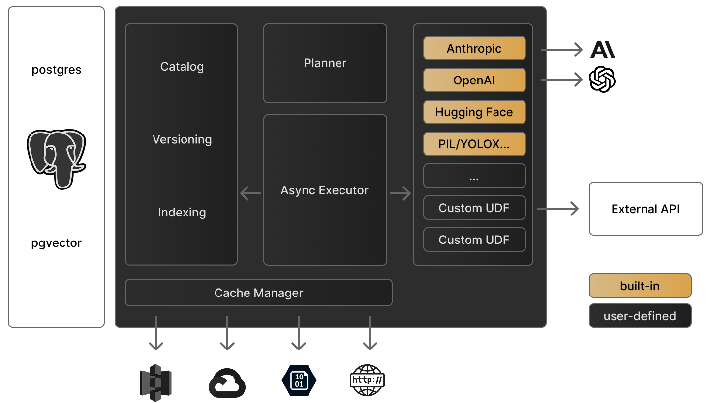

<Tip>
  Use Pixeltable directly in Google Colab: [Pixeltable Basics Tutorial](https://colab.research.google.com/github/pixeltable/pixeltable/blob/release/docs/notebooks/pixeltable-basics.ipynb).
</Tip>

## Local Pixeltable Runtime


## System Requirements

Before installing, ensure your system meets these requirements:

- Python 3.10 or higher
- Linux, MacOS, or Windows

<Tabs>
  <Tab title="Python venv">
    <Steps>
      <Step title="Create virtual environment">
        ```bash
        python -m venv venv
        ```
        This creates an isolated Python environment for your Pixeltable installation.
      </Step>
      <Step title="Activate environment">
        <CodeGroup>
          ```bash Linux/MacOS
          source venv/bin/activate
          ```
          ```bash Windows
          venv\Scripts\activate
          ```
        </CodeGroup>
      </Step>
      <Step title="Install Pixeltable">
        ```bash
        pip install pixeltable
        ```
      </Step>
    </Steps>
  </Tab>
  <Tab title="Conda/Miniconda">
    <Steps>
      <Step title="Install Miniconda">
        Download and install from [Miniconda Installation Guide](https://www.anaconda.com/docs/getting-started/miniconda/main)
      </Step>
      <Step title="Create environment">
        ```bash
        conda create --name pxt python=3.12
        conda activate pxt
        ```
      </Step>
      <Step title="Install Pixeltable">
        ```bash
        pip install pixeltable
        ```
      </Step>
    </Steps>
  </Tab>
</Tabs>

## Notebooks

<Steps>
  <Step title="Install Jupyter">
    If not already installed:
    ```bash
    pip install jupyter
    ```
  </Step>
  <Step title="Start Jupyter server">
    ```bash
    jupyter notebook
    ```
  </Step>
  <Step title="Create notebook">
    Select "Python 3 (ipykernel)" as the kernel via File / New / Notebook
  </Step>
  <Step title="Test installation">
    ```python
    import pixeltable as pxt
    pxt.init()
    ```
  </Step>
</Steps>

<Warning>
  Wait a minute for Pixeltable to load. You should see a message once connected to the database.
</Warning>

<Card title="Configuration" icon="gear" href="/overview/configuration">
  See the configuration guide for details on system settings and API configuration
</Card>


## Troubleshooting

Common installation issues and solutions:

<AccordionGroup>
  <Accordion title="Package conflicts">
    If you encounter package conflicts:
    ```bash
    pip install --upgrade pip
    pip cache purge
    pip install -U pixeltable --no-cache-dir
    ```
  </Accordion>

  <Accordion title="Database connection issues">
    If Pixeltable fails to initialize:
    1. First, restart your Python session or kernel
    2. Then try initializing again:
    ```python
    import pixeltable as pxt
    pxt.init()
    ```
  </Accordion>

  <Accordion title="GPU support">
    1. Install [pytorch](https://pytorch.org/get-started/locally/)
    2. Pixeltable will automatically use GPU once torch is installed.
  </Accordion>
</AccordionGroup>

## Next Steps

<CardGroup cols={2}>
  <Card title="Quick Start Tutorial" icon="play" href="/overview/quick-start">
    Build your first AI application with Pixeltable
  </Card>
  <Card title="Example Gallery" icon="images" href="/examples/sample-apps">
    Explore example applications and use cases
  </Card>
</CardGroup>

## Getting Help

- 💬 Join our [Discord Community](https://discord.gg/pixeltable)
- 🐛 Report issues on [GitHub](https://github.com/pixeltable/pixeltable/issues)
- 📧 Contact [support@pixeltable.com](mailto:support@pixeltable.com)
