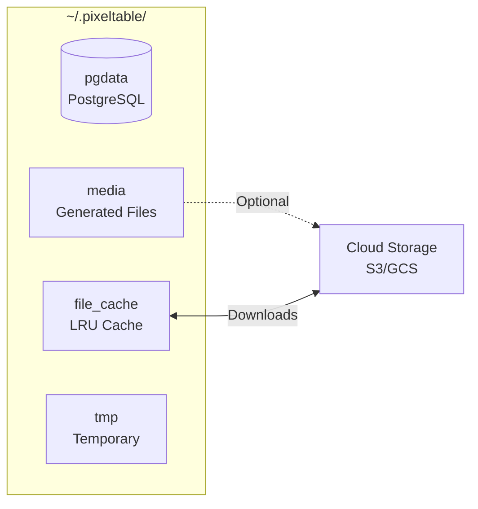

## Code Organization

Both deployment strategies require separating schema definition from application code.

**Schema Definition (`setup_pixeltable.py`):**
- Defines directories, tables, views, computed columns, indexes
- Acts as Infrastructure-as-Code for Pixeltable entities
- Version controlled in Git
- Executed during initial deployment and schema migrations

**Application Code (`app.py`, `endpoints.py`, `functions.py`):**
- Assumes Pixeltable infrastructure exists
- Interacts with tables via `pxt.get_table()` and `@pxt.udf`
- Handles missing tables/views gracefully

**Configuration (`config.py`):**
- Externalizes model IDs, API keys, thresholds, connection strings
- Uses environment variables (`.env` + `python-dotenv`) or secrets management
- Never hardcodes secrets

```python
# setup_pixeltable.py
import pixeltable as pxt
import config

pxt.create_dir(config.APP_NAMESPACE, if_exists='ignore')

pxt.create_table(
    f'{config.APP_NAMESPACE}.documents',
    {
        'document': pxt.Document,
        'metadata': pxt.Json,
        'timestamp': pxt.Timestamp
    },
    if_exists='ignore'  # Idempotent: safe for repeated execution
)

# ---

# app.py
import pixeltable as pxt
import config

docs_table = pxt.get_table(f'{config.APP_NAMESPACE}.documents')
if docs_table is None:
    raise RuntimeError(
        f"Table '{config.APP_NAMESPACE}.documents' not found. "
        "Run setup_pixeltable.py first."
    )
```

## Project Structure

<Tabs>
  <Tab title="Project Structure">
```
project/
├── config.py              # Environment variables, model IDs, API keys
├── functions.py           # Custom UDFs (imported as modules)
├── setup_pixeltable.py    # Schema definition (tables, views, indexes)
├── app.py                 # Application endpoints (FastAPI/Flask)
├── requirements.txt       # Pinned dependencies
└── .env                   # Secrets (gitignored)
```
  </Tab>

  <Tab title="config.py">
```python
import os

ENV = os.getenv('ENVIRONMENT', 'dev')
APP_NAMESPACE = f'{ENV}_myapp'

# Model Configuration
EMBEDDING_MODEL = os.getenv('EMBEDDING_MODEL', 'intfloat/e5-large-v2')
OPENAI_MODEL = os.getenv('OPENAI_MODEL', 'gpt-4o-mini')

# Storage
MEDIA_STORAGE_BUCKET = os.getenv('MEDIA_STORAGE_BUCKET')

# Prompts
RAG_SYSTEM_PROMPT = """You are a helpful assistant. Use the provided context to answer questions."""
```
  </Tab>

  <Tab title="functions.py">
```python
import pixeltable as pxt

@pxt.udf
def format_prompt(context: list, question: str) -> str:
    """Format RAG prompt with context."""
    context_str = "\n".join([doc['text'] for doc in context])
    return f"Context:\n{context_str}\n\nQuestion: {question}"

@pxt.udf(resource_pool='request-rate:my_service')
async def call_custom_model(prompt: str) -> dict:
    """Call self-hosted model endpoint."""
    # Your custom logic here
    return {"response": "..."}
```
  </Tab>

  <Tab title="setup_pixeltable.py">
```python
import pixeltable as pxt
from pixeltable.functions.huggingface import sentence_transformer
import config
from functions import format_prompt  # Import module UDFs

# Create namespace
pxt.create_dir(config.APP_NAMESPACE, if_exists='ignore')

# Define base table
docs = pxt.create_table(
    f'{config.APP_NAMESPACE}.documents',
    {'document': pxt.Document, 'metadata': pxt.Json, 'timestamp': pxt.Timestamp},
    if_exists='ignore'
)

# Add computed columns
docs.add_computed_column(
    embedding=sentence_transformer(docs.document, model_id=config.EMBEDDING_MODEL),
    if_exists='ignore'
)

# Add embedding index for similarity search
docs.add_embedding_index('embedding', metric='cosine', if_not_exists=True)

# Define retrieval query function
@pxt.query
def search_documents(query_text: str, limit: int = 5):
    """RAG retrieval query."""
    sim = docs.embedding.similarity(query_text)
    return docs.order_by(sim, asc=False).limit(limit).select(docs.document, sim)
```
  </Tab>

  <Tab title="app.py">
```python
from fastapi import FastAPI
import pixeltable as pxt
from setup_pixeltable import search_documents
import config

app = FastAPI()
docs_table = pxt.get_table(f'{config.APP_NAMESPACE}.documents')

@app.get("/search")
async def search(query: str, limit: int = 5):
    results = search_documents(query, limit).collect()
    return {"results": list(results)}
```
  </Tab>
</Tabs>

<Note>
**Key Principles:**
- **Module UDFs** (`functions.py`): Update when code changes; improve testability. [Learn more](/platform/udfs-in-pixeltable)
- **Retrieval Queries** (`@pxt.query`): Encapsulate complex retrieval logic as reusable functions.
- **Idempotency:** Use `if_exists='ignore'` to make `setup_pixeltable.py` safely re-runnable.
</Note>

## Storage Architecture

Pixeltable is an OLTP database built on embedded PostgreSQL. It uses multiple storage mechanisms:



<Tip>
**Important Concept:** Pixeltable directories (`pxt.create_dir`) are logical namespaces in the catalog, NOT filesystem directories.
</Tip>

**How Media is Stored:**
- PostgreSQL stores only file paths/URLs, never raw media data.
- Inserted local files: path stored, original file remains in place.
- Inserted URLs: URL stored, file downloaded to File Cache on first access.
- Generated media (computed columns): saved to Media Store (default: local, configurable to S3/GCS/Azure per-column).
- File Cache size: configure via `file_cache_size_g` in `~/.pixeltable/config.toml`. [See configuration guide](/platform/configuration)

**Deployment-Specific Storage Patterns:**

*Approach 1 (Orchestration Layer):*
- Pixeltable storage can be ephemeral (re-computable).
- Processing results exported to external RDBMS and blob storage.
- Reference input media from S3/GCS/Azure URIs.

*Approach 2 (Full Backend):*
- Pixeltable IS the RDBMS (embedded PostgreSQL, not replaceable).
- Requires persistent volume at `~/.pixeltable` (pgdata, media, file_cache).
- Media Store configurable to S3/GCS/Azure buckets for generated files.

## Dependency Management

**Virtual Environments:**
Use `venv`, `conda`, or `uv` to isolate dependencies.

**Requirements:**
```txt
# requirements.txt
pixeltable==0.4.6
fastapi==0.115.0
uvicorn[standard]==0.32.0
pydantic==2.9.0
python-dotenv==1.0.1
sentence-transformers==3.3.0  # If using embedding indexes
```
- Pin versions: `package==X.Y.Z`
- Include integration packages (e.g., `openai`, `sentence-transformers`)
- Test updates in staging before production

## Data Interoperability

Pixeltable integrates with existing data pipelines via import/export capabilities.

**Import:**
- CSV, Excel, JSON: `pxt.io.import_csv()`, `pxt.io.import_excel()`, `pxt.io.import_json()`
- Parquet: `pxt.io.import_parquet()`
- Pandas DataFrames: `table.insert(df)` or `pxt.create_table(source=df)`
- Hugging Face Datasets: `pxt.io.import_huggingface_dataset()`

**Export:**
- Parquet: `pxt.io.export_parquet(table, path)` for data warehousing
- LanceDB: `pxt.io.export_lancedb(table, db_uri, table_name)` for vector databases
- PyTorch: `table.to_pytorch_dataset()` for ML training pipelines
- COCO: `table.to_coco_dataset()` for computer vision
- Pandas: `table.collect().to_pandas()` for analysis

```python
# Export query results to Parquet
import pixeltable as pxt

docs_table = pxt.get_table('myapp.documents')
results = docs_table.where(docs_table.timestamp > '2024-01-01')
pxt.io.export_parquet(results, '/data/exports/recent_docs.parquet')
```

