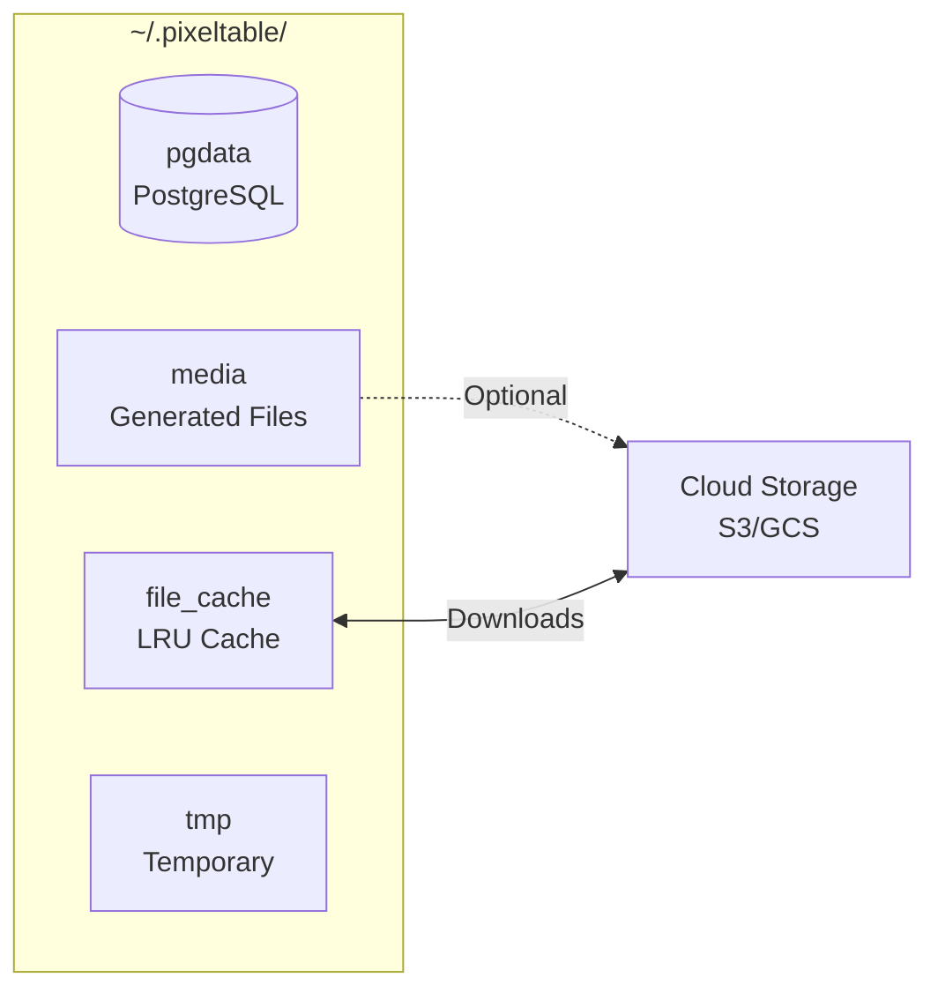

## Code Organization

Separate schema definition from router logic.

**Schema Definition (`setup_pixeltable.py`):**
- Tables, views, computed columns, indexes, and agent-internal `@pxt.query` functions
- Flat module with `if_exists='ignore'` for idempotency (no `setup()` wrapper, no `_initialized` flag)
- Run once before starting workers: `python setup_pixeltable.py`

**Router Files (`routers/data.py`, `routers/search.py`, etc.):**
- Call `pxt.get_table()` directly to get table handles
- Define router-facing `@pxt.query` functions next to the routes that use them
- No `import setup_pixeltable` needed; tables already exist from the init step

**Configuration (`config.py`):**
- Externalizes model IDs, API keys, thresholds, connection strings
- Uses environment variables (`.env` + `python-dotenv`) or secrets management
- Never hardcodes secrets

```python
# setup_pixeltable.py — creates tables (flat, idempotent, no queries for routers)
import pixeltable as pxt
import config

pxt.create_dir(config.APP_NAMESPACE, if_exists='ignore')

docs = pxt.create_table(
    f'{config.APP_NAMESPACE}/documents',
    {'document': pxt.Document, 'metadata': pxt.Json, 'timestamp': pxt.Timestamp},
    if_exists='ignore',
)

# ---

# routers/data.py — queries live next to the routes that use them
import pixeltable as pxt
from pixeltable.serving import FastAPIRouter
import config

router = FastAPIRouter(prefix="/api/data", tags=["data"])
docs = pxt.get_table(f'{config.APP_NAMESPACE}/documents')

@pxt.query
def list_documents():
    return docs.select(docs.title, docs.document).order_by(docs.title)

router.add_query_route(path="/documents", query=list_documents, method="get")
```

## Project Structure

<Tabs>
  <Tab title="Project Structure">
```
project/
├── config.py              # Environment variables, model IDs, API keys
├── functions.py           # Custom UDFs (imported as modules)
├── setup_pixeltable.py     # Schema definition (tables, views, indexes)
├── main.py                # FastAPI app, mounts routers
├── routers/
│   ├── data.py            # CRUD routes + queries for data pipeline
│   ├── search.py          # Search routes + queries
│   └── agent.py           # Agent routes (declarative + hand-written)
├── requirements.txt       # Pinned dependencies
└── .env                   # Secrets (gitignored)
```
  </Tab>

  <Tab title="config.py">
```python
import os

ENV = os.getenv('ENVIRONMENT', 'dev')
APP_NAMESPACE = f'{ENV}_myapp'

# Model Configuration
EMBEDDING_MODEL = os.getenv('EMBEDDING_MODEL', 'intfloat/e5-large-v2')
OPENAI_MODEL = os.getenv('OPENAI_MODEL', 'gpt-4o-mini')

# Storage
MEDIA_STORAGE_BUCKET = os.getenv('MEDIA_STORAGE_BUCKET')

# Prompts
RAG_SYSTEM_PROMPT = """You are a helpful assistant. Use the provided context to answer questions."""
```
  </Tab>

  <Tab title="functions.py">
```python
import pixeltable as pxt

@pxt.udf
def format_prompt(context: list, question: str) -> str:
    """Format RAG prompt with context."""
    context_str = "\n".join([doc['text'] for doc in context])
    return f"Context:\n{context_str}\n\nQuestion: {question}"

@pxt.udf(resource_pool='request-rate:my_service')
async def call_custom_model(prompt: str) -> dict:
    """Call self-hosted model endpoint."""
    # Your custom logic here
    return {"response": "..."}
```
  </Tab>

  <Tab title="setup_pixeltable.py">
```python
import pixeltable as pxt
from pixeltable.functions.huggingface import sentence_transformer
import config

pxt.create_dir(config.APP_NAMESPACE, if_exists='ignore')

docs = pxt.create_table(
    f'{config.APP_NAMESPACE}/documents',
    {'document': pxt.Document, 'metadata': pxt.Json, 'timestamp': pxt.Timestamp},
    if_exists='ignore',
)

docs.add_computed_column(
    embedding=sentence_transformer(docs.document, model_id=config.EMBEDDING_MODEL),
    if_exists='ignore',
)

docs.add_embedding_index('embedding', metric='cosine', if_not_exists=True)
```
  </Tab>

  <Tab title="routers/search.py">
```python
import pixeltable as pxt
from pixeltable.serving import FastAPIRouter
import config

router = FastAPIRouter(prefix="/api/search", tags=["search"])
docs = pxt.get_table(f'{config.APP_NAMESPACE}/documents')

@pxt.query
def search_documents(query_text: str, limit: int = 5):
    sim = docs.embedding.similarity(string=query_text)
    return docs.order_by(sim, asc=False).limit(limit).select(docs.document, sim)

router.add_query_route(path="/documents", query=search_documents)
```
  </Tab>

  <Tab title="main.py">
```python
from fastapi import FastAPI
from routers import data, search

app = FastAPI()
app.include_router(data.router)
app.include_router(search.router)
```
  </Tab>
</Tabs>

<Note>
**Key Principles:**
- **Schema separate from routers:** `setup_pixeltable.py` defines tables/views/indexes. Router files define `@pxt.query` functions next to the routes that use them. No cross-imports needed.
- **Module UDFs** (`functions.py`): Update when code changes; improve testability. [Learn more](/platform/udfs-in-pixeltable)
- **Idempotency:** Use `if_exists='ignore'` to make `setup_pixeltable.py` safely re-runnable.
- **Built-in HTTP serving:** For standard endpoints, consider [`pxt serve`](/howto/deployment/serving) with a TOML config.
- **`return_rows=True`:** Pass to `insert()`/`update()` to get computed column values back without a follow-up query. See [HTTP Serving](/howto/deployment/serving#reading-back-computed-columns-after-insert).
- **Multi-worker deployments:** With `--workers N`, run `python setup_pixeltable.py` before `uvicorn` so schema creation happens once, not per worker (see [Starter Kit Dockerfile](https://github.com/pixeltable/pixeltable-starter-kit)).
</Note>

<Card title="Pixeltable Starter Kit" icon="github" href="https://github.com/pixeltable/pixeltable-starter-kit">
  See this structure in action: a production-ready FastAPI + React app with schema definition, config, UDFs, and endpoint routers already wired up. Includes deployment configs for Docker, Helm, Terraform (EKS/GKE/AKS), and AWS CDK.
</Card>

## Storage Architecture

Pixeltable is an OLTP database built on embedded PostgreSQL. It uses multiple storage mechanisms:


```mermaid
flowchart LR
    subgraph Home[~/.pixeltable/]
        direction TB
        PG[(pgdata<br/>PostgreSQL)]
        Media[media<br/>Generated Files]
        Cache[file_cache<br/>LRU Cache]
        Tmp[tmp<br/>Temporary]
    end

    Cloud[Cloud Storage<br/>S3/GCS]

    Media -.->|Optional| Cloud
    Cache <-->|Downloads| Cloud
```

<Tip>
**Important Concept:** Pixeltable directories (`pxt.create_dir`) are logical namespaces in the catalog, NOT filesystem directories.
</Tip>

**How Media is Stored:**
- PostgreSQL stores only file paths/URLs, never raw media data.
- Inserted local files: path stored, original file remains in place.
- Inserted URLs: URL stored, file downloaded to File Cache on first access.
- Generated media (computed columns): saved to Media Store (default: local, configurable to S3/GCS/Azure per-column).
- File Cache size: configure via `file_cache_size_g` in `~/.pixeltable/config.toml`. [See configuration guide](/platform/configuration)

<Tip>
For large datasets with remote media, consider increasing file cache size to avoid repeated downloads (default is 20% of available disk):

```toml
# ~/.pixeltable/config.toml
file_cache_size_g = 50  # 50 GB cache
```
</Tip>

### References, Not Copies

Unlike vector databases that require ingesting data into their own storage format, Pixeltable stores **references** to external files. Your original media stays in S3/GCS/Azure; only computed results (embeddings, metadata, generated media) are stored locally or in configured cloud buckets.


```mermaid
flowchart LR
    S3[S3 / GCS / Azure] -. reference .-> PXT[Pixeltable]
    PXT --> Meta[Computed Results]
    PXT -. lazy load .-> S3
```

This means:
- **No data duplication** — you don't pay for storage twice.
- **Schema changes don't require re-upload** — add a column, not a migration script.
- **Works with existing storage** — point Pixeltable at your current buckets.

**Deployment-Specific Storage Patterns:**

*Approach 1 (Orchestration Layer):*
- Pixeltable storage can be ephemeral (re-computable).
- Processing results exported to external RDBMS and blob storage.
- Reference input media from S3/GCS/Azure URIs.

*Approach 2 (Full Backend):*
- Pixeltable IS the RDBMS (embedded PostgreSQL, not replaceable).
- Requires persistent volume at `~/.pixeltable` (pgdata, media, file_cache).
- Media Store configurable to S3/GCS/Azure buckets for generated files.

All [Starter Kit](https://github.com/pixeltable/pixeltable-starter-kit) deployment configs set `PIXELTABLE_HOME=/data/pixeltable` pointing to persistent storage (Docker volumes, K8s PVCs, or EFS). For large media workloads, configure external blob storage:

```bash
PIXELTABLE_INPUT_MEDIA_DEST=s3://your-bucket/input    # or gs:// or az://
PIXELTABLE_OUTPUT_MEDIA_DEST=s3://your-bucket/output
```

## Dependency Management

**Virtual Environments:**
Use `venv`, `conda`, or `uv` to isolate dependencies.

**Requirements:**
```txt
# requirements.txt
pixeltable==0.4.6
fastapi==0.115.0
uvicorn[standard]==0.32.0
pydantic==2.9.0
python-dotenv==1.0.1
sentence-transformers==3.3.0  # If using embedding indexes
```
- Pin versions: `package==X.Y.Z`
- Include integration packages (e.g., `openai`, `sentence-transformers`)
- Test updates in staging before production

## Data Interoperability

Pixeltable integrates with existing data pipelines via import/export capabilities. See the [Import/Export SDK reference](/sdk/latest/io) for full details.

**Import:**
- CSV, Excel, JSON: [`pxt.io.import_csv()`](/sdk/latest/io#func-import_csv), [`pxt.io.import_excel()`](/sdk/latest/io#func-import_excel), [`pxt.io.import_json()`](/sdk/latest/io#func-import_json)
- Parquet: [`pxt.io.import_parquet()`](/sdk/latest/io#func-import_parquet)
- Pandas DataFrames: [`table.insert(df)`](/sdk/latest/table#method-insert) or [`pxt.create_table(source=df)`](/sdk/latest/pixeltable#func-create_table)
- Hugging Face Datasets: [`pxt.io.import_huggingface_dataset()`](/sdk/latest/io#func-import_huggingface_dataset)

**Export:**
- CSV: [`pxt.io.export_csv(table, path)`](/sdk/latest/io#func-export_csv) for tabular data
- JSON: [`pxt.io.export_json(table, path)`](/sdk/latest/io#func-export_json) for structured data
- Parquet: [`pxt.io.export_parquet(table, path)`](/sdk/latest/io#func-export_parquet) for data warehousing
- LanceDB: [`pxt.io.export_lancedb(table, db_uri, table_name)`](/sdk/latest/io#func-export_lancedb) for vector databases
- PyTorch: [`table.to_pytorch_dataset()`](/sdk/latest/query#method-to_pytorch_dataset) for ML training pipelines
- COCO: [`table.to_coco_dataset()`](/sdk/latest/query#method-to_coco_dataset) for computer vision
- Pandas: [`table.collect().to_pandas()`](/sdk/latest/query#method-collect) for analysis

```python
# Export query results to Parquet
import pixeltable as pxt

docs_table = pxt.get_table('myapp/documents')
results = docs_table.where(docs_table.timestamp > '2024-01-01')
pxt.io.export_parquet(results, '/data/exports/recent_docs.parquet')
```
