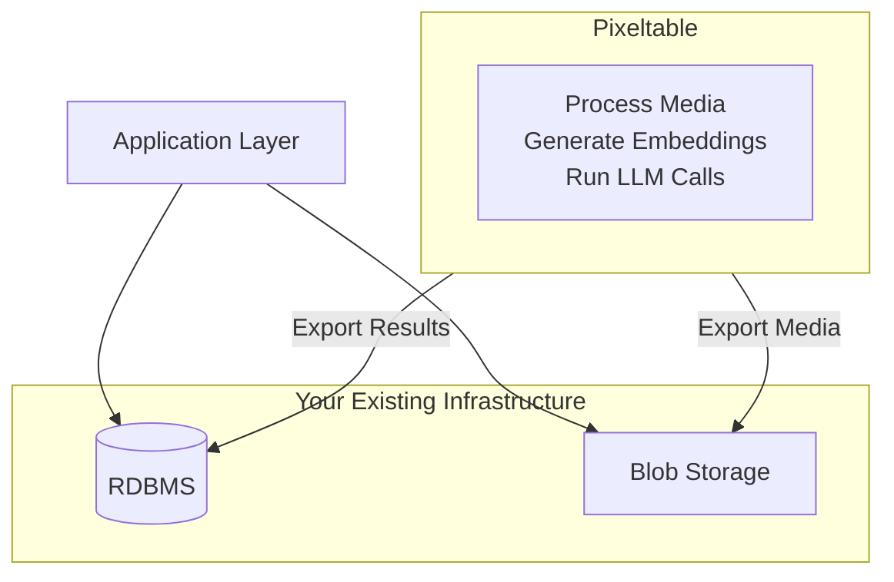
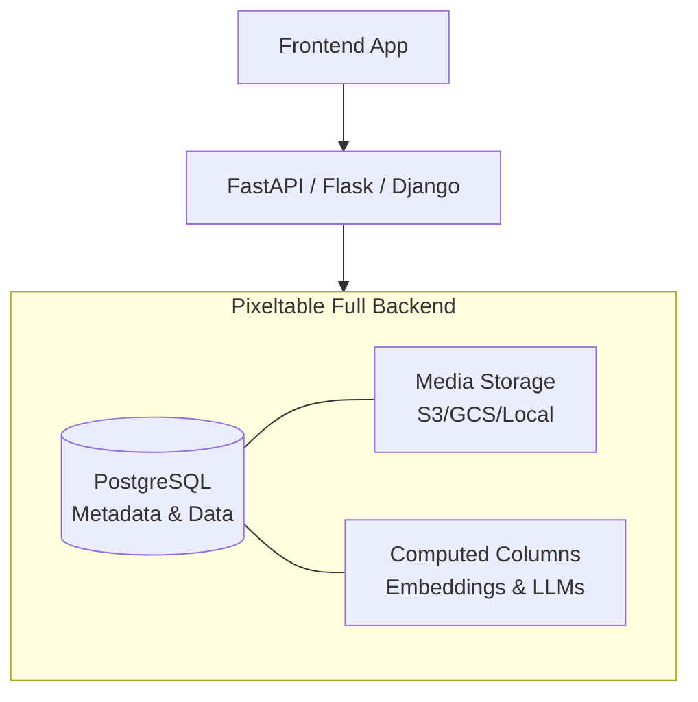

## Deployment Decision Guide

Pixeltable supports two production deployment patterns. Choose based on your constraints:

| Question | Answer | Recommendation |
|----------|--------|----------------|
| Existing production DB that must stay? | Yes | **Orchestration Layer** |
| Building new multimodal app? | Yes | **Full Backend** |
| Need semantic search (RAG)? | Yes | **Full Backend** |
| Only ETL/transformation? | Yes | **Orchestration Layer** |
| Expose Pixeltable as MCP server for LLM tools? | Yes | **Full Backend** + [MCP Server](/libraries/mcp) |


### Technical Capabilities (Both)

Regardless of deployment mode, you get:
- **[Multimodal Types](/platform/type-system):** Native handling of Video, Document, Audio, Image, JSON.
- **[Computed Columns](/tutorials/computed-columns):** Automatic incremental updates and dependency tracking.
- **[Views & Iterators](/platform/views):** Built-in logic for chunking documents, extracting frames, etc.
- **[Model Orchestration](/integrations/frameworks):** Rate-limited API calls to OpenAI, Anthropic, Gemini, local models.
- **[Data Interoperability](/sdk/latest/io):** Import/export Parquet, PyTorch, LanceDB, pandas.
- **[Configurable Media Storage](/platform/configuration):** Per-column destination (local or cloud bucket).

---

## Deployment Strategies

### Approach 1: Pixeltable as Orchestration Layer

Use Pixeltable for multimodal data orchestration while retaining your existing data infrastructure.



<AccordionGroup>
  <Accordion title="Use When" icon="check">
    - Existing RDBMS (PostgreSQL, MySQL) and blob storage (S3, GCS, Azure Blob) must remain
    - Application already queries a separate data layer
    - Incremental adoption required with minimal stack changes
  </Accordion>

  <Accordion title="Architecture" icon="sitemap">
    - Deploy Pixeltable in Docker container or dedicated compute instance
    - Define tables, views, computed columns, and UDFs for multimodal processing
    - Process videos, documents, audio, images within Pixeltable
    - Export structured outputs (embeddings, metadata, classifications) to RDBMS
    - Export generated media to blob storage
    - Application queries existing data layer, not Pixeltable
  </Accordion>

  <Accordion title="What This Provides" icon="sparkles">
    - Native multimodal type system (Video, Document, Audio, Image, JSON)
    - Declarative computed columns eliminate orchestration boilerplate
    - Incremental computation automatically handles new data
    - UDFs encapsulate transformation logic
    - LLM call orchestration with automatic rate limiting
    - Iterators for chunking documents, extracting frames, splitting audio
  </Accordion>
</AccordionGroup>

```python
# Example: Orchestrate in Pixeltable, export to external systems
import pixeltable as pxt
from pixeltable.functions.video import extract_audio
from pixeltable.functions.openai import transcriptions
from pixeltable.iterators import FrameIterator
import psycopg2
from datetime import datetime

# Setup: Define Pixeltable orchestration pipeline
pxt.create_dir('video_processing', if_exists='ignore')

videos = pxt.create_table(
    'video_processing.videos',
    {'video': pxt.Video, 'uploaded_at': pxt.Timestamp}
)

# Computed columns for orchestration
videos.add_computed_column(
    audio=extract_audio(videos.video, format='mp3')
)
videos.add_computed_column(
    transcript=transcriptions(audio=videos.audio, model='whisper-1')
)

# Optional: Add LLM-based summary
from pixeltable.functions.openai import chat_completions
videos.add_computed_column(
    summary=chat_completions(
        messages=[{'role': 'user', 'content': f"Summarize: {videos.transcript.text}"}],
        model='gpt-4o-mini'
    )
)

# Extract frames for analysis
frames = pxt.create_view(
    'video_processing.frames',
    videos,
    iterator=FrameIterator.create(video=videos.video, fps=1.0)
)

# Insert video for processing
videos.insert([{'video': 's3://bucket/video.mp4', 'uploaded_at': datetime.now()}])

# Export structured results to external RDBMS
conn = psycopg2.connect("postgresql://...")
cursor = conn.cursor()

for row in videos.select(videos.video, videos.transcript).collect():
    cursor.execute(
        "INSERT INTO video_metadata (video_url, transcript_json) VALUES (%s, %s)",
        (row['video'], row['transcript'])
    )
conn.commit()
```

### Approach 2: Pixeltable as Full Backend

Use Pixeltable for both orchestration and storage as your primary data backend.



<AccordionGroup>
  <Accordion title="Use When" icon="check">
    - Building new multimodal AI application
    - Semantic search and vector similarity required
    - Storage and ML pipeline need tight integration
    - Stack consolidation preferred over separate storage/orchestration layers
  </Accordion>

  <Accordion title="Architecture" icon="sitemap">
    - Deploy Pixeltable on persistent instance (EC2 with EBS, EKS with persistent volumes, VM)
    - Build API endpoints (FastAPI, Flask, Django) that interact with Pixeltable tables
    - Frontend calls endpoints to insert data and retrieve results
    - Query using Pixeltable's semantic search, filters, joins, and aggregations
    - All data stored in Pixeltable: metadata, media references, computed column results
  </Accordion>

  <Accordion title="What This Provides" icon="sparkles">
    - Unified storage, computation, and retrieval in single system
    - Native semantic search via embedding indexes (pgvector)
    - No synchronization layer between storage and orchestration
    - Automatic versioning and lineage tracking
    - Incremental computation propagates through views
    - LLM/agent orchestration
    - Data export to PyTorch, Parquet, LanceDB
  </Accordion>
</AccordionGroup>

```python
# Example: FastAPI endpoints backed by Pixeltable
from fastapi import FastAPI, UploadFile
from datetime import datetime
import pixeltable as pxt

app = FastAPI()
docs_table = pxt.get_table('myapp.documents')  # Has computed columns: embedding, summary

@app.post("/documents/upload")
async def upload_document(file: UploadFile):
    status = docs_table.insert([{
        'document': file.filename,
        'uploaded_at': datetime.now()
    }])
    return {"rows_inserted": status.num_rows}

@app.get("/documents/search")
async def search_documents(query: str, limit: int = 10):
    sim = docs_table.embedding.similarity(query)
    results = docs_table.select(
        docs_table.document,
        docs_table.summary,  # LLM-generated summary (computed column)
        similarity=sim
    ).order_by(sim, asc=False).limit(limit).collect()

    return {"results": list(results)}

@app.get("/documents/{doc_id}")
async def get_document(doc_id: int):
    result = docs_table.where(docs_table._rowid == doc_id).collect()
    return result[0] if len(result) > 0 else {"error": "Not found"}
```

## Next Steps

<CardGroup cols={2}>
  <Card title="Infrastructure Setup" icon="server" href="/howto/deployment/infrastructure">
    Code organization and storage architecture
  </Card>
  <Card title="Production Operations" icon="gears" href="/howto/deployment/operations">
    Concurrency, error handling, and schema evolution
  </Card>
</CardGroup>

