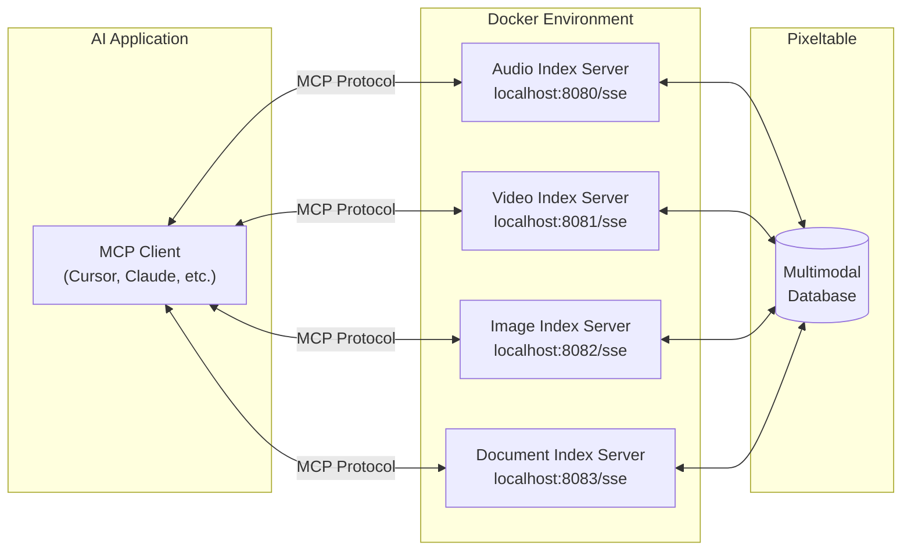

<Card title="Pixeltable MCP servers" icon="github" href="https://github.com/pixeltable/pixeltable-mcp-server">
  View the source code and contribute to our Pixeltable MCP servers
</Card>

## What is MCP?

The [Model Context Protocol (MCP)](https://modelcontextprotocol.io/) is an open protocol that standardizes how applications provide context to Large Language Models (LLMs). Think of MCP like a USB-C port for AI applications - it provides a standardized way to connect AI models to different data sources and tools.

MCP follows a client-server architecture where:

- **MCP Hosts**: Programs like Claude Desktop, IDEs, or AI tools that want to access data through MCP
- **MCP Clients**: Protocol clients that maintain 1:1 connections with servers
- **MCP Servers**: Lightweight programs that each expose specific capabilities through the standardized Model Context Protocol
- **Local Data Sources**: Your computer's files, databases, and services that MCP servers can securely access
- **Remote Services**: External systems available over the internet (e.g., through APIs) that MCP servers can connect to

## Why We Built Pixeltable MCP Servers

Pixeltable excels at handling multimodal data - audio, video, images, and documents. However, LLMs often struggle with these data types without specialized tools. By implementing MCP servers for Pixeltable, we've created a bridge that allows LLMs to:

1. **Access multimodal data**: LLMs can now directly work with audio transcriptions, video frames, image analysis, and document content
2. **Perform specialized operations**: Each server provides domain-specific tools optimized for its data type
3. **Maintain security**: Data remains within your infrastructure while still being accessible to LLMs
4. **Standardize interactions**: Using the MCP protocol ensures compatibility with a growing ecosystem of AI applications

## Our MCP Server Collection

We've developed a suite of specialized MCP servers that expose Pixeltable's multimodal capabilities:

### Audio Index Server

Located in `servers/audio-index/`, this server provides:
- Audio file indexing with transcription capabilities
- Semantic search over audio content
- Multi-index support for audio collections
- Accessible at `/audio` endpoint

### Video Index Server

Located in `servers/video-index/`, this server provides:
- Video file indexing with frame extraction
- Content-based video search
- Accessible at `/video` endpoint

### Image Index Server

Located in `servers/image-index/`, this server provides:
- Image indexing with object detection
- Similarity search for images
- Accessible at `/image` endpoint

### Document Index Server

Located in `servers/doc-index/`, this server provides:
- Document indexing with text extraction
- Retrieval-Augmented Generation (RAG) support
- Accessible at `/doc` endpoint

### Base SDK Server

Located in `servers/base-sdk/`, this server provides:
- Core functionality for Pixeltable integration
- Foundation for building specialized servers

## How It Works

Our MCP servers follow this general architecture:



When an AI application needs to work with multimodal data:

1. You start the Pixeltable MCP servers using docker-compose
2. Your MCP client (like Cursor) connects to the servers via the localhost URLs (e.g., `http://localhost:8080/sse`)
3. The servers expose their capabilities through the standardized MCP protocol
4. Your AI application can now discover and use these capabilities
5. The servers handle all the complex data processing using Pixeltable
6. Results are returned to your AI application in a format it can understand and use

## MCP Features Supported

Our servers implement the following MCP capabilities:

| Feature | Support | Description |
|---------|---------|-------------|
| [Resources](https://modelcontextprotocol.io/docs/concepts/resources) | ✅ | Access to indexed multimodal data |
| [Tools](https://modelcontextprotocol.io/docs/concepts/tools) | ✅ | Specialized operations for each data type |
| [Prompts](https://modelcontextprotocol.io/docs/concepts/prompts) | ✅ | Pre-defined templates for common tasks |
| [Sampling](https://modelcontextprotocol.io/docs/concepts/sampling) | ❌ | Not currently implemented |

## Getting Started

### Installation

To use our MCP servers with Pixeltable:

```bash
# Clone the repository
git clone https://github.com/pixeltable/mcp-server-pixeltable.git
cd mcp-server-pixeltable/servers

# Run locally with docker-compose
docker-compose up --build
```

That's it! The servers are now running as remote services that your MCP clients can connect to.

### Configuration

Each server runs on its designated port and is accessible via localhost:
- Audio Index Server: `http://localhost:8080/sse`
- Video Index Server: `http://localhost:8081/sse`
- Image Index Server: `http://localhost:8082/sse`
- Document Index Server: `http://localhost:8083/sse`

You can configure service settings in the respective Dockerfile or through environment variables.

### Using with MCP Clients

To use these servers with any MCP client (like Cursor, Claude Desktop, or other MCP-compatible tools):

1. Start the servers using docker-compose as shown above
2. In your MCP client, add the server URLs:
   - For Audio Index: `http://localhost:8080/sse`
   - For Video Index: `http://localhost:8081/sse`
   - For Image Index: `http://localhost:8082/sse`
   - For Document Index: `http://localhost:8083/sse`

No complex configuration is needed - just add the URLs to your client and start using the enhanced capabilities!

### Example: Adding to Cursor

1. Open Cursor
2. Go to Settings > MCP
3. Add the server URLs (e.g., `http://localhost:8080/sse`)
4. Save and start using the Pixeltable MCP capabilities

## Example Use Cases

Here are some examples of what you can do with our MCP servers:

### Audio Analysis

```
Can you transcribe this audio file and summarize the key points?
```

### Video Content Search

```
Find all scenes in this video that contain people talking about climate change.
```

### Image Recognition

```
Analyze this collection of product images and identify any quality issues.
```

### Document Intelligence

```
Extract the main arguments from these legal documents and compare them.
```

## Benefits of MCP Integration

By integrating Pixeltable with MCP, we've created several advantages:

1. **Enhanced AI capabilities**: LLMs can now work with rich multimodal data
2. **Standardized interface**: Consistent interaction patterns across different data types
3. **Simple deployment**: Just run `docker-compose up` and connect via localhost URLs
4. **No complex configuration**: Add the server URLs directly to your MCP client
5. **Works with any MCP client**: Compatible with Cursor, Claude Desktop, and other MCP-enabled tools
6. **Extensible architecture**: Easy to add new capabilities or data types
7. **Growing ecosystem**: Part of the expanding MCP ecosystem

## Future Development

We're actively working on enhancing our MCP servers with:

- Additional data type support
- More sophisticated indexing and search capabilities
- Improved performance for large datasets
- Extended tool functionality
- Better integration with the broader MCP ecosystem

## Contributing

We welcome contributions to our MCP server implementations! Please check our [GitHub repository](https://github.com/pixeltable/pixeltable-mcp-server) for contribution guidelines.

## Support

- GitHub Issues: [Report bugs or request features](https://github.com/pixeltable/pixeltable-mcp-server/issues)
- Discord: Join our [community](https://discord.com/invite/QPyqFYx2UN)

## Learn More

- [Pixeltable Documentation](/)
- [Model Context Protocol](https://modelcontextprotocol.io/)
- [MCP Specification](https://spec.modelcontextprotocol.io/)
