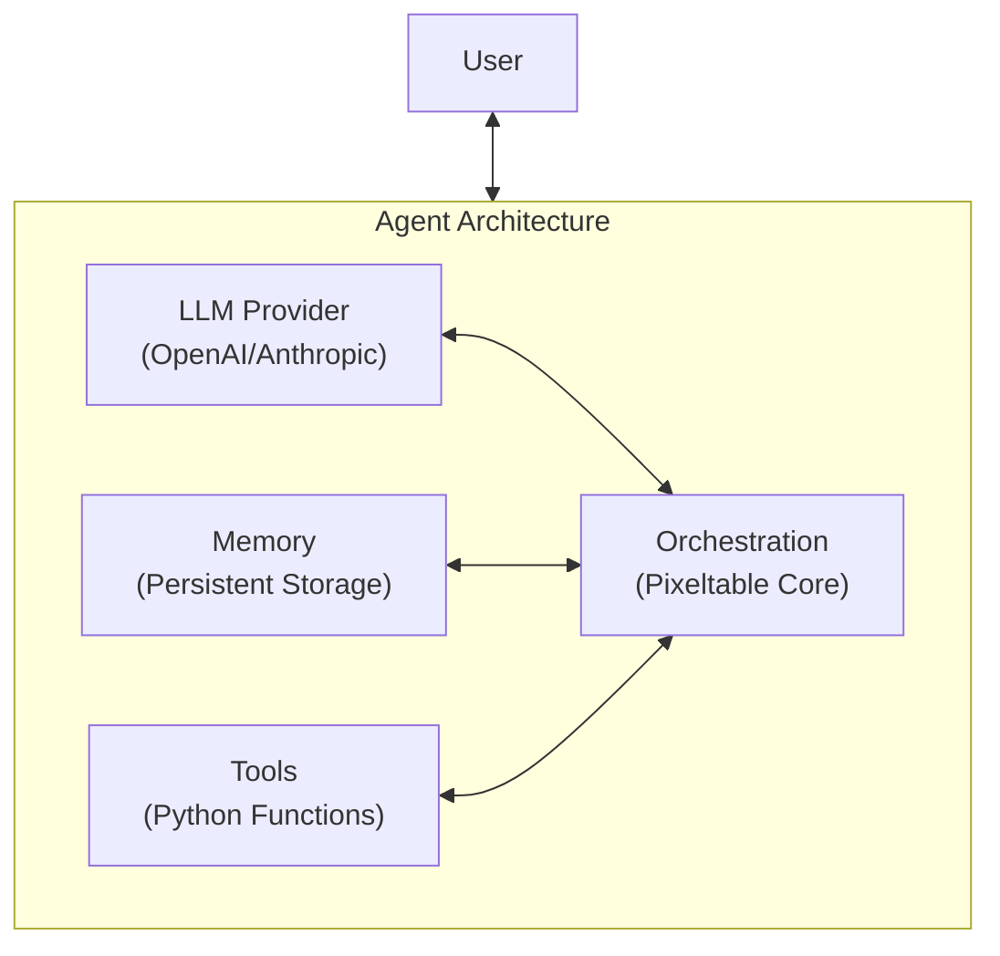

<Card title="Pixelagent" icon="github" href="https://github.com/pixeltable/pixelagent">
  View the source code and contribute to Pixelagent
</Card>

# Pixelagent: An Agent Engineering Blueprint

We see agents as the intersection of an LLM, storage, and orchestration. Pixeltable unifies this interface into a single declarative framework, making it the de-facto choice for engineers to build custom agentic applications with build-your-own functionality for memory, tool-calling, and more.

Pixelagent is more than just another agent framework—it's a comprehensive guide to building production-grade agent systems from the ground up. With our blueprint approach, you'll learn the engineering patterns behind successful agent architectures while leveraging Pixeltable's powerful data management capabilities to handle the complex infrastructure needs.

### The Engineering Journey

We start with fundamental patterns and gradually introduce complexity, allowing you to understand every aspect of agent construction:

1. **Single-Provider Implementation**: Master core agent functionality with one LLM provider
2. **Multi-Provider Architecture**: Extend your solution to support multiple LLMs through clean inheritance
3. **Advanced Capabilities**: Add specialized extensions for memory, reasoning, reflection, and more

### Start with a single-provider `Agent()` class

<CardGroup cols={2}>
  <Card
    title="Anthropic Agent"
    icon="brain"
    href="https://github.com/pixeltable/pixelagent/tree/main/guides/anthropic/README.md"
  >
    Learn how we craft an agent using Claude, with cost-saving tricks like skipping chat history in tool calls
  </Card>
  <Card
    title="OpenAI Agent"
    icon="sparkles"
    href="https://github.com/pixeltable/pixelagent/tree/main/guides/openai/README.md"
  >
    See how we use GPT models to create a lean, powerful agent with the same Pixeltable-driven efficiency
  </Card>
</CardGroup>

The foundation of our blueprint begins with creating a simple yet powerful Agent class for a single LLM provider. This initial step focuses on establishing core functionality like conversation handling, memory management, and basic tool integration. By starting with a single provider, you'll learn the fundamental patterns that can later be extended to support additional LLM services.

The Agent() class is built on three core components:

1. **Memory Management**: Using Pixeltable tables to store conversation history and enable persistent memory across sessions
2. **Chat Pipeline**: A series of computed columns that process user input and generate responses
3. **Tool Execution**: Optional support for executing functions/tools during conversations

### Next: Extend `Agent()` to multiple providers

Once you've mastered building an agent for a single LLM provider, the next step is extending your architecture to support multiple providers. This progression is crucial for production systems that need flexibility to switch between different LLM services based on capabilities, cost, or availability. Our blueprint demonstrates a clean, inheritance-based approach to achieve this multi-provider support without duplicating code.

By implementing a BaseAgent abstract class that handles common functionality, you can create specialized provider-specific implementations that override only what's unique to each provider. This architecture allows you to maintain a consistent interface while adapting to the nuances of different LLM APIs.

<Card
  title="Build with Multiple Providers"
  icon="layer-group"
  href="https://github.com/pixeltable/pixelagent/tree/main/blueprints/multi_provider/README.md"
>
  Learn how to extend the Agent class to support multiple LLM providers
</Card>

## Plug-and-Play Extensions

With a solid agent foundation in place, the final step is adding specialized capabilities that transform a basic conversational agent into a sophisticated AI system. Our blueprint includes detailed implementations of the most important agentic patterns, each designed as modular extensions that can be mixed and matched based on your specific requirements.

These extensions leverage Pixeltable's data management capabilities to implement complex features like long-term memory, reflection loops, and multi-step reasoning—all while maintaining a clean, maintainable codebase. Each extension is explained with both theoretical background and practical implementation details, allowing you to understand not just how to use them, but how they work under the hood.

<CardGroup cols={2}>
  <Card
    title="Tools"
    icon="wrench"
    href="https://github.com/pixeltable/pixelagent/tree/main/examples/tool-calling"
  >
    Add custom python functions as tools to enable your agent to interact with external systems, retrieve information, and perform actions beyond just conversation.
  </Card>
  <Card
    title="Memory"
    icon="database"
    href="https://github.com/pixeltable/pixelagent/tree/main/examples/memory"
  >
    Implement sophisticated memory systems that allow your agent to recall past interactions, store knowledge, and perform semantic search over its memory.
  </Card>
  <Card
    title="Reflection"
    icon="rotate"
    href="https://github.com/pixeltable/pixelagent/blob/main/examples/reflection/reflection.md"
  >
    Add self-improvement capabilities through reflection loops where agents can evaluate their own performance and adjust their behavior accordingly.
  </Card>
  <Card
    title="Reasoning"
    icon="brain"
    href="https://github.com/pixeltable/pixelagent/tree/main/examples/planning"
  >
    Implement advanced reasoning patterns like ReAct and Chain-of-Thought to handle complex multi-step tasks with robust problem-solving capabilities.
  </Card>
</CardGroup>

## Usage

Pixelagent is designed to be both powerful and approachable. Our API emphasizes clarity and simplicity, allowing you to get started quickly while still having access to advanced features when needed. The following examples demonstrate how to use Pixelagent in various scenarios, from basic conversational agents to complex systems with tools and specialized reasoning patterns.

<AccordionGroup>
  <Accordion title="Installation" icon="download">
    ```bash
    pip install pixelagent
    # Install provider-specific dependencies
    pip install anthropic  # For Claude models
    pip install openai     # For GPT models
    ```
  </Accordion>

  <Accordion title="Quick Start" icon="play">
    ```python
    from pixelagent.anthropic import Agent  # Or from pixelagent.openai import Agent

    # Create a simple agent
    agent = Agent(
        agent_name="my_assistant",
        system_prompt="You are a helpful assistant."
    )

    # Chat with your agent
    response = agent.chat("Hello, who are you?")
    print(response)
    ```
  </Accordion>

  <Accordion title="Adding Tools" icon="wrench">
    ```python
    import pixeltable as pxt
    from pixelagent.anthropic import Agent
    import yfinance as yf

    # Define a tool as a UDF
    @pxt.udf
    def stock_price(ticker: str) -> dict:
        """Get stock information for a ticker symbol"""
        stock = yf.Ticker(ticker)
        return stock.info

    # Create agent with tool
    agent = Agent(
        agent_name="financial_assistant",
        system_prompt="You are a financial analyst assistant.",
        tools=pxt.tools(stock_price)
    )

    # Use tool calling
    result = agent.tool_call("What's the current price of NVDA?")
    print(result)
    ```
  </Accordion>

  <Accordion title="Access Conversation Memory" icon="database">
    ```python
    import pixeltable as pxt

    # Agent memory is automatically persisted
    memory = pxt.get_table("my_assistant.memory")
    conversations = memory.collect()

    # Access tool call history
    tools_log = pxt.get_table("financial_assistant.tools")
    tool_history = tools_log.collect()
    ```
  </Accordion>
</AccordionGroup>

## Advanced Features

Beyond the basics, Pixelagent provides sophisticated capabilities that allow you to build production-grade agent systems. These features demonstrate the power of combining Pixeltable's data management with advanced agent patterns, enabling you to create AI systems that can handle complex tasks, maintain context over long conversations, and adapt to changing requirements.

<AccordionGroup>
  <Accordion title="Unlimited Memory" icon="infinity">
    ```python
    # Unlimited memory
    infinite_agent = Agent(
        agent_name="historian",
        system_prompt="You remember everything.",
        n_latest_messages=None  # No limit on conversation history
    )
    ```
  </Accordion>

  <Accordion title="ReAct Pattern" icon="diagram-project">
    ```python
    import re
    from datetime import datetime
    from pixelagent.openai import Agent
    import pixeltable as pxt

    # Define a tool
    @pxt.udf
    def stock_info(ticker: str) -> dict:
        """Get stock information for analysis"""
        import yfinance as yf
        stock = yf.Ticker(ticker)
        return stock.info

    # ReAct system prompt with structured reasoning pattern
    REACT_PROMPT = """
    Today is {date}

    IMPORTANT: You have {max_steps} maximum steps. You are on step {step}.

    Follow this EXACT step-by-step reasoning and action pattern:

    1. THOUGHT: Think about what information you need to answer the question.
    2. ACTION: Either use a tool OR write "FINAL" if you're ready to give your final answer.

    Available tools:
    {tools}

    Always structure your response with these exact headings:

    THOUGHT: [your reasoning]
    ACTION: [tool_name] OR simply write "FINAL"
    """

    # Helper function to extract sections from responses
    def extract_section(text, section_name):
        pattern = rf'{section_name}:?\s*(.*?)(?=\n\s*(?:THOUGHT|ACTION):|$)'
        match = re.search(pattern, text, re.DOTALL | re.IGNORECASE)
        return match.group(1).strip() if match else ""

    # Execute ReAct planning loop
    def run_react_loop(question, max_steps=5):
        step = 1
        while step <= max_steps:
            # Dynamic system prompt with current step
            react_system_prompt = REACT_PROMPT.format(
                date=datetime.now().strftime("%Y-%m-%d"),
                tools=["stock_info"],
                step=step,
                max_steps=max_steps,
            )

            # Agent with updated system prompt
            agent = Agent(
                agent_name="financial_planner",
                system_prompt=react_system_prompt,
                reset=False,  # Maintain memory between steps
            )

            # Get agent's response for current step
            response = agent.chat(question)

            # Extract action to determine next step
            action = extract_section(response, "ACTION")

            # Check if agent is ready for final answer
            if "FINAL" in action.upper():
                break

            # Call tool if needed
            if "stock_info" in action.lower():
                tool_agent = Agent(
                    agent_name="financial_planner",
                    tools=pxt.tools(stock_info)
                )
                tool_agent.tool_call(question)

            step += 1

        # Generate final recommendation
        return Agent(agent_name="financial_planner").chat(question)

    # Run the planning loop
    recommendation = run_react_loop("Create an investment recommendation for AAPL")
    ```
  </Accordion>
</AccordionGroup>

## Architecture

At its core, Pixelagent implements a clean, modular architecture that separates concerns while maintaining flexibility. This diagram illustrates the main components and their relationships, showing how the system integrates LLM providers, memory, tools, and orchestration into a cohesive whole.



## Tutorials and Examples

We provide comprehensive examples and tutorials to help you get started quickly and master advanced concepts. These resources range from basic implementation guides to sophisticated patterns for specialized use cases, ensuring you have the knowledge to build exactly what you need.

<CardGroup cols={3}>
  <Card
    title="Getting Started"
    icon="book"
    href="https://github.com/pixeltable/pixelagent/tree/main/examples/getting-started"
  >
    Step-by-step introduction to core concepts
  </Card>
  <Card
    title="Advanced Patterns"
    icon="lightbulb"
    href="https://github.com/pixeltable/pixelagent/tree/main/examples"
  >
    Explore reflection and planning techniques
  </Card>
  <Card
    title="Specialized Techniques"
    icon="puzzle-piece"
    href="https://github.com/pixeltable/pixelagent/tree/main/examples"
  >
    Browse examples for deeper implementations
  </Card>
</CardGroup>

<Note>
Ready to start building? Dive into the blueprints, tweak them to your needs, and let Pixeltable handle the AI data infrastructure while you focus on innovation!
</Note>
