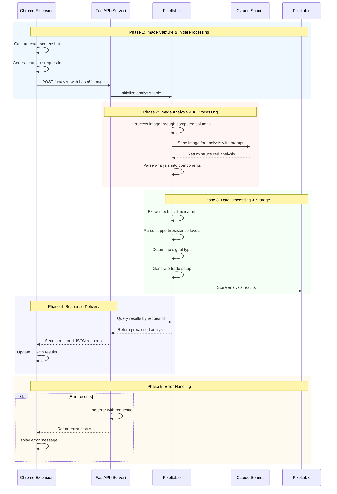

# AI-based Day Trading Insights - Chrome Extension 📈

[](https://www.python.org/downloads/) [](https://github.com/pixeltable/pixeltable) [](https://www.anthropic.com/)

A Chrome extension powered by Pixeltable and Claude Sonnet that provides real-time technical analysis and trading insights for stock market charts. It leverages advanced AI to analyze chart patterns, technical indicators, and market conditions to help traders make more informed decisions.


## 🌟 Features

### Real-time Technical Analysis

Analyze the captured image to detect:
- Support & Resistance Level Detection
- Key Technical Indicators (MACD, RSI, Stochastic)
- Volume Analysis & Price Action
- VWAP and more

### Smart Trade Setup
- Automated Entry Point Detection
- Dynamic Stop Loss Calculation
- Price Target Generation

### AI-Powered Pattern Recognition
- Chart Pattern Identification
- Trend Analysis & Direction
- Signal Generation (Bullish/Bearish/Neutral)
- Multi-timeframe Confirmation if available

## 🔄 Request Flow & ID Tracking

The extension uses a request ID system to ensure accurate matching between requests and responses:

### Request ID System
1. **Generation & Format**
   ```typescript
   // Client-side generation (Chrome extension)
   function generateRequestId(): string {
     const timestamp = Date.now();
     const random = Math.random().toString(36).substring(2, 10);
     return `${timestamp}_${random}`;
   }
   ```

2. **ID Implementation**
   ```python
   class ScreenshotRequest(BaseModel):
       screenshot: str
       requestId: Optional[str] = None

       @property
       def get_request_id(self) -> str:
           if not self.requestId:
               timestamp = datetime.now().strftime("%Y%m%d_%H%M%S")
               self.requestId = f"auto_{timestamp}_{os.urandom(4).hex()}"
           return self.requestId
   ```

### Request-Response Flow
1. **Client Generation**: Extension creates unique ID per request
2. **Server Processing**: Backend tracks analysis with ID
3. **Response Matching**: Results paired via ID verification
4. **Error Tracking**: All logs tagged with request IDs

## 🚀 Installation

### Backend Setup
```bash
# Create virtual environment (optional)
python -m venv venv
source venv/bin/activate  # Windows: .\venv\Scripts\activate

# Install dependencies
pip install -r requirements.txt

# Start backend
python -m uvicorn main:app
```

### Extension Setup
1. Open Chrome and navigate to `chrome://extensions/`
2. Enable "Developer mode"
3. Click "Load unpacked"
4. Select the `dist` directory to upload all the related files

## 🔧 Technology Stack

### Backend Infrastructure
- **FastAPI**: Backend framework
- **Pixeltable**: AI data infrastructure
- **Anthropic**: LLM

### Extension Components
- Chrome Extension API
- HTML, CSS, & JavaScript

## 📊 System Architecture

### Data Flow
1. **Chart Capture**: Extension captures current view
2. **Image Processing**: Pixeltable stores image, build custom function, and orchestrate data transformation and API calls.
3. **AI Analysis**: Claude processes chart
4. **Data Processing**: Results structured via Pixeltable
5. **Response Delivery**: Analysis displayed in UI



## 🔍 Troubleshooting

### Common Problems
- Extension not loading: Check manifest.json
- Analysis timeout: Verify API keys
- Image processing: Check screenshot format

## ⚠️ Disclaimer

This application is for educational and research purposes only. Do not use it to make financial decisions. Always consult with a licensed financial advisor before making any investment decisions.