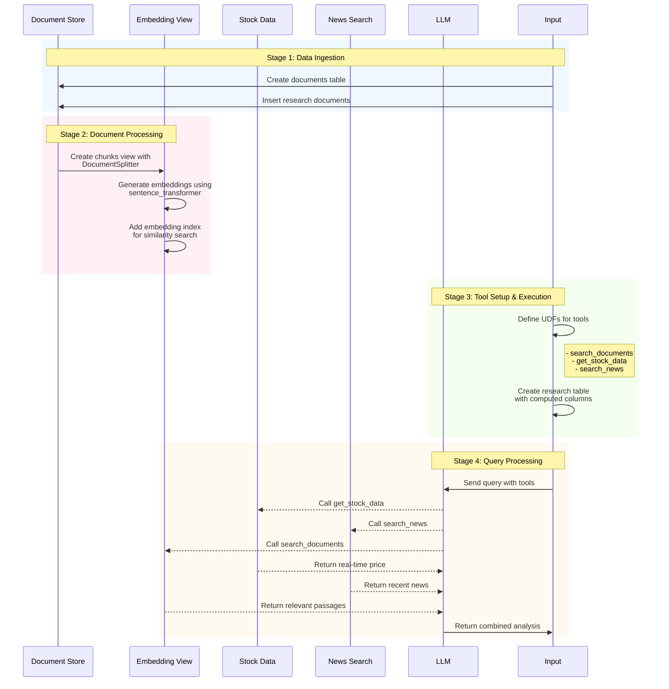

# AI Research Assistant 🔍

Below is a minimalist example showing how to leverage tools to build agentic workflow using [Pixeltable](https://github.com/pixeltable/pixeltable).

## 🔥 Key Differentiators

**1. Declarative Data Lineage**
- Unlike traditional RAG pipelines that require manual orchestration, Pixeltable automatically:
  * Tracks data dependencies between transformations
  * Handles incremental updates when source data changes
  * Maintains version history of all transformations

**2. Unified Multimodal Infrastructure**
- Instead of managing separate systems for different data types:
  * Single interface for text, image, video processing and more...
  * Automatic format conversion and validation
  * Native support for embedding operations

**3. Computed Column and UDFs**
- Compared to workflow frameworks:
  * No need to define DAGs explicitly
  * Changes automatically propagate through dependent columns
  * Built-in caching and incremental computation

**4. Production-Ready Features**
- Enterprise capabilities out of the box:
  * Automatic schema validation and type checking
  * Support for parallel processing

## 🚀 Pixeltable Architecture Overview



## Setup

```bash
pip install -r requirements.txt
```

Create .env file

```bash
OPENAI_API_KEY=sk-...
NEWS_API_KEY=... # from newsapi.org
```

## Usage

```bash
# Query the assistant:
python main.py -q "What's up with Amazon?"

# Run sample queries:
python main.py -s
```
## 🛠 What Makes This Special
Pixeltable solves the critical infrastructure challenges in building production-ready AI agents:

- **Declarative and Incremental**: Automatic storage, orchestration, versioning and lineage tracking
  - Changes propagate automatically through computed columns
   - New questions and documents are processed incrementally
   - Embeddings are maintained up-to-date
   - Retrieval is declarative and efficient
- **Multimodal**: Seamlessly integrate text, images, video, audio, JSON, Array and more.
- **Flexible Tool Integration**: Easy to add new tools with UDFs.
- **Complete Visibility**: Introspect every step of your agent's decision-making, retrieve any data and easily translate into endpoints.

## 📚 Resources

You can learn more about how Pixeltable works through other sample applications such as our [multimodal RAG app](https://github.com/pixeltable/pixeltable/tree/main/docs/sample-apps/multimodal-chat), our [infinite-memory discord bot](https://github.com/pixeltable/pixeltable/tree/main/docs/sample-apps/context-aware-discord-bot), and our [text and image similarity search on video](https://github.com/pixeltable/pixeltable/tree/main/docs/sample-apps/text-and-image-similarity-search-nextjs-fastapi).

- [Pixeltable Documentation](https://docs.pixeltable.com)
- [RAG Examples](https://docs.pixeltable.com/docs/document-indexing-and-rag)
- [User-Defined Functions Guide](https://docs.pixeltable.com/docs/user-defined-functions-udfs)
- [Discord](https://discord.gg/QPyqFYx2UN)