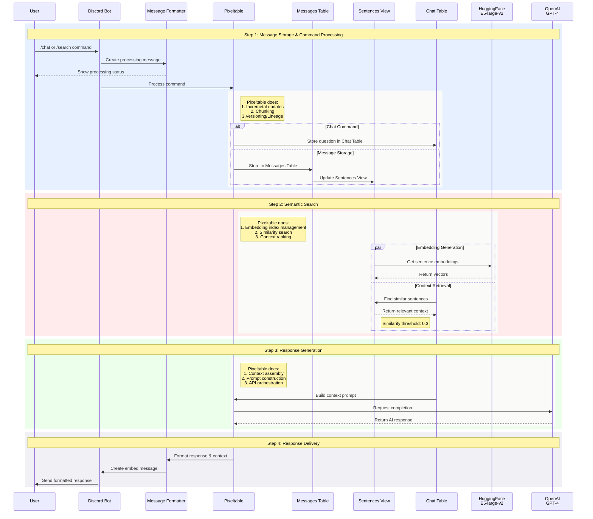
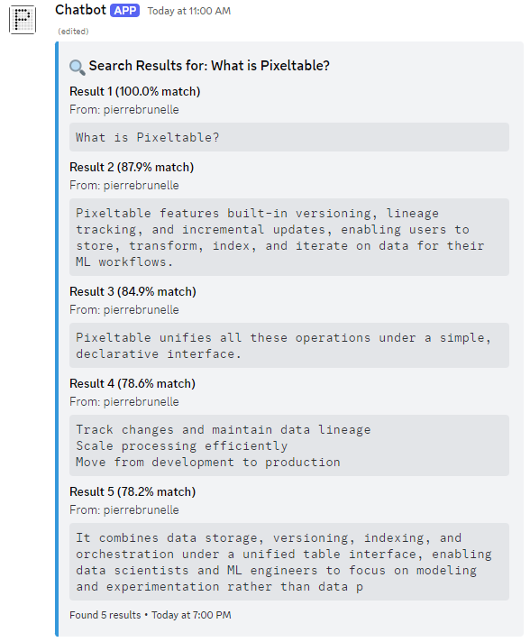
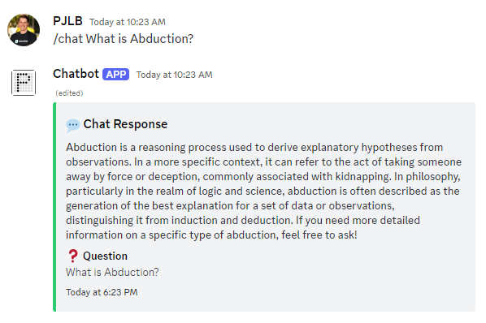
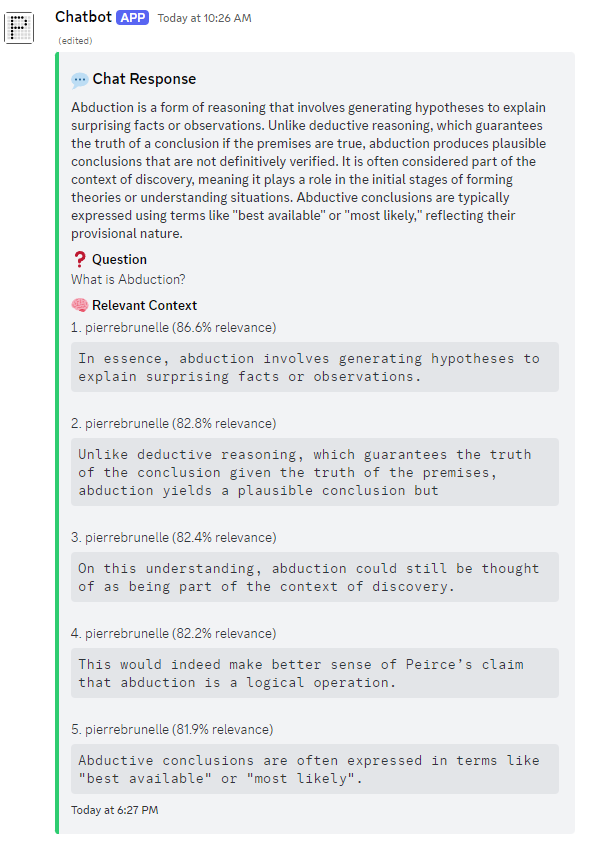

# 🤖 Context-Aware Discord Bot: Incremental RAG
[](https://www.python.org/downloads/) [](https://github.com/Rapptz/discord.py) [](https://pypi.org/project/pixeltable/)

A Discord bot that remembers and learns from conversations using [Pixeltable](https://github.com/pixeltable/pixeltable) for semantic search and context awareness.

## Command Flow
This architecture provides a way to solve a fundamental challenge in building LLM-based chatbots: maintaining context. Traditional chatbots are limited by fixed context windows and struggle with maintaining long-term memory between conversations.



## Quick Start

This guide assumes that you have your [Discord server setup](https://github.com/pixeltable/pixeltable/tree/main/examples/context-aware-discord-bot#-discord-setup-guide).

```bash
# 1. Clone and setup
git clone https://github.com/pixeltable/pixeltable.git
cd https://github.com/pixeltable/pixeltable/tree/main/examples/context-aware-discord-bot

python -m venv venv
source venv/bin/activate  # Windows: venv\Scripts\activate

# 2. Install dependencies
pip install -r requirements.txt

# 3. Set environment variables in .env
DISCORD_TOKEN=your-discord-token
OPENAI_API_KEY=your-openai-key

# 4. Run the bot
python bot.py
```
## Key Commands

- `/search [query]`: Find semantically similar messages

- `/chat [question]`: Get AI responses with conversation context

## How It Works?

<div align="center">
  <table>
    <tr>
      <td align="center" width="50%" style="vertical-align: top;">
        <h4>/Search<h4>
        
        <br>
      </td>
      <td align="center" width="50%" style="vertical-align: top;">
        <h4>/Chat<h4>
        <h6>Pre-Discord Activity<h6>
        
        <h6>Post-Discord Activity<h6>
        
        <br>
      </td>
    </tr>
  </table>
</div>

[Pixeltable](https://github.com/pixeltable/pixeltable) is AI Data infrastructure providing a declarative, incremental approach for multimodal workloads. Transformations, model inference, and custom logic are embedded as computed columns, automatically capturing relationships between data, transformations, and model outputs for full reproducibility.

```python
# 1. Store and index messages at sentence level
messages_view = pxt.create_view(
    'discord_bot.sentences',
    messages_table,
    iterator=StringSplitter.create(
        text=messages_table.content,
        separators='sentence'
    )
)

# 2. Generate embeddings for semantic search
messages_view.add_embedding_index('text', string_embed=get_embeddings)

# 3. Get relevant context for questions
@pxt.query
def get_context(question_text: str):
    sim = messages_view.text.similarity(question_text)
    return messages_view.order_by(sim, asc=False).select(
        text=messages_view.text,
        username=messages_view.username,
        sim=sim
    ).limit(5)

# 4. Generate AI responses with context
chat_table['response'] = openai.chat_completions(
    messages=[
        {
            "role": "system",
            "content": "Answer based on the context provided."
        },
        {
            "role": "user",
            "content": chat_table.prompt
        }
    ],
    model='gpt-4o-mini'
)
```

## Discord Setup Guide

1. Create app at [Discord Developer Portal](https://discord.com/developers/applications)
2. Add bot to your application
3. Enable intents: `Messages`, `Server Members`, `Message Content`
4. Generate invite URL with `bot` and `application.commands` scopes
5. Invite bot to your server

**Required bot permissions:**
- Read Messages/View Channels
- Send Messages & Manage Messages
- Create & Manage Threads
- Add Reactions
- Use Slash Commands

## What else can you do with this?

#### Make this your local AI assistant with multimodal capabilities:

- 🖼️ **Image Understanding**: [Add image search and analysis](https://github.com/pixeltable/pixeltable/tree/main/examples/text-and-image-similarity-search-nextjs-fastapi)
- 🎥 **Video Processing**: [Index and search video content](https://huggingface.co/spaces/Pixeltable/Call-Analysis-AI-Tool)
- 🔊 **Audio Analysis**: [Transcribe and analyze voice messages](https://docs.pixeltable.com/docs/transcribing-and-indexing-audio-and-video)
- 💻 **Local Deployment**: Run entirely on your hardware with [Ollama](https://docs.pixeltable.com/docs/working-with-ollama)/[Llama.cpp](https://docs.pixeltable.com/docs/working-with-llamacpp)

More examples available on our [Hugging Face Spaces](https://huggingface.co/Pixeltable).

#### Enhanced Memory Management

- Split storage into active and archival memory tables
- Add character limits for active memory storage
- Implement importance scoring for messages
- Create automated archival process for old/less relevant messages

#### Improved Search & Retrieval

- Implement cross-table semantic search
- Add relevance scoring for search results
- Create smart context merging from both memory types
- Add result ranking based on recency and relevance

## Support & Resources

- 📚 [Documentation](https://docs.pixeltable.com/)
- 🐛 [Issue Tracker](https://github.com/pixeltable/pixeltable/issues)
- 💬 [Discord Community](https://discord.gg/6MnmFYZJ9N)
- 💡 [Discussions](https://github.com/orgs/pixeltable/discussions)
