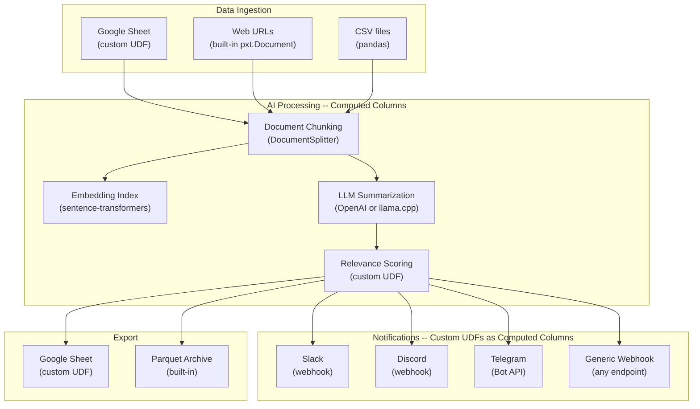

# Intelligence Hub

A complete data automation pipeline built with [Pixeltable](https://github.com/pixeltable/pixeltable). Ingests from multiple sources, AI-processes everything through computed columns, and fans out notifications and exports across channels.

**One Python script replaces an entire n8n / Zapier workflow.**

This sample app is also a **cookbook for custom UDFs** -- every file in `custom_udfs/` is a copy-pasteable recipe showing how to connect Pixeltable to external services. Pixeltable is data infrastructure: you can build whatever you want on top of it. This template demonstrates the pattern.

## Architecture



## Quick Start

```bash
git clone https://github.com/pixeltable/pixeltable.git
cd pixeltable/docs/sample-apps/intelligence-hub

# Environment
uv sync                         # or: pip install -e .
cp .env.example .env            # optionally add OPENAI_API_KEY (falls back to local llama.cpp)

# Initialize schema (one-time)
python setup_pixeltable.py

# Ingest seed data
python ingest.py
```

That's it. The pipeline works **with no API keys** -- it falls back to a local Llama 3.2 1B model via llama.cpp. Set `OPENAI_API_KEY` in `.env` for better summaries. Notifications and Google Sheets are optional -- configure them in `.env` if you want.

## Data Flow Walkthrough

Running `setup_pixeltable.py` + `ingest.py` produces the following end-to-end pipeline:

### Step 1: Input -- Sources Table

Data enters from multiple sources (web URLs, CSV, Google Sheets) into a single `sources` table:

```
                             title origin                                        url
0  Pixeltable License (Apache 2.0)    web  https://raw.githubusercontent.com/.../LICENSE
1       Pixeltable Code of Conduct    csv  https://raw.githubusercontent.com/.../CODE_OF_CONDUCT.md
```

### Step 2: Chunking -- Automatic Document Processing

Pixeltable creates a `chunks` view that splits each document into sentences, then embeds each chunk with sentence-transformers:

```
Total chunks: 794

                                   text                       title
0  Contributor Covenant Code of Conduct  Pixeltable Code of Conduct
1         utor Covenant Code of Conduct  Pixeltable Code of Conduct
2              Covenant Code of Conduct  Pixeltable Code of Conduct
```

No code needed for this step -- the `document_splitter` iterator and `add_embedding_index` in `setup_pixeltable.py` handle it automatically on every insert.

### Step 3: AI Processing -- Computed Columns

Each source gets a summary (via LLM), a relevance score, and a formatted alert -- all as computed columns that run automatically:

```
--- Source: Pixeltable License (Apache 2.0) ---
  Summary: The Pixeltable License is a free and open-source software license,
           specifically designed for web applications, under the Apache 2.0 license...
  Relevance: 0.0
  Alert: [Intelligence Hub] New item (relevance 0%)
         *Pixeltable License (Apache 2.0)*
         The Pixeltable License is a free and open-source software license...
```

Relevance is 0% here because the license/CoC don't match the configured keywords (AI, data, pipeline, etc.). With real content, scores would be higher and notifications would fire.

### Step 4: Semantic Search -- Query Anytime

Search across all ingested content using the embedding index:

```python
sim = chunks.text.similarity(string='contributing code to the project')
result = chunks.order_by(sim, asc=False).limit(3).select(chunks.text, sim=sim).collect()
```

```
                                                     text       sim
0  ...contributions that are not aligned to this Code...  0.447
1  ...commits, code, wiki edits, issues...               0.446
2  Contributor Covenant Code of Conduct                   0.437
```

### The Key Insight

**All four steps happen automatically from a single `insert()` call.** Insert a row into `sources` and Pixeltable:

1. Fetches the document from the URL
2. Chunks it into sentences
3. Embeds each chunk for search
4. Summarizes with an LLM
5. Scores relevance
6. Formats and sends notifications (if configured)

No triggers, no cron jobs, no orchestrator. This is what makes Pixeltable different from n8n/Zapier -- the pipeline is the table.

## How to Use

### 1. Initialize the schema

```bash
python setup_pixeltable.py
```

This creates the `intelligence_hub` namespace with:
- A `sources` table (URL, title, document, origin, metadata)
- A `chunks` view (document splitting + sentence-transformer embedding index)
- Computed columns for summarization, relevance scoring, and alert formatting
- Notification columns for any configured channels (Slack, Discord, Telegram)

### 2. Ingest data

```bash
python ingest.py
```

This loads data from three sources to demonstrate breadth:
- **Web URLs** -- inserted directly; Pixeltable fetches and parses content automatically
- **Google Sheets** -- pulled via `gspread` (if configured)
- **CSV file** -- `sample_sources.csv` is included as a default

### 3. Add more data anytime

The pipeline is **incremental**. Every insert triggers all computed columns automatically:

```python
import pixeltable as pxt

sources = pxt.get_table('intelligence_hub.sources')
sources.insert([{
    'url': 'https://example.com/new-article',
    'title': 'New Article',
    'doc': 'https://example.com/new-article',
    'origin': 'manual',
    'metadata': {'category': 'research'},
}])
# Summarization, scoring, notifications all execute automatically
```

### 4. Search across all content

```python
import pixeltable as pxt

chunks = pxt.get_table('intelligence_hub.chunks')
sim = chunks.text.similarity(string='your search query')
results = chunks.order_by(sim, asc=False).limit(5).select(chunks.text, sim=sim).collect()
print(results)
```

### 5. Export results

```python
import pixeltable as pxt

sources = pxt.get_table('intelligence_hub.sources')
pxt.io.export_parquet(
    sources.select(sources.title, sources.summary, sources.relevance),
    'output/results.parquet',
)
```

## Project Structure

```
intelligence-hub/
  config.py               Environment vars, model IDs, thresholds
  functions.py            @pxt.udf definitions (scoring, formatting, prompts)
  setup_pixeltable.py     Schema: tables, views, computed columns, indexes
  ingest.py               Data ingestion from multiple sources
  pyproject.toml          Dependencies (uv sync)
  .env.example            API keys template
  sample_sources.csv      Default seed data
  custom_udfs/            Service integration UDFs (the cookbook)
    webhook.py            Generic HTTP POST/GET (any endpoint)
    slack.py              Slack incoming webhook
    discord.py            Discord webhook
    telegram.py           Telegram Bot API
    google_sheets.py      Import from + export to Google Sheets
  README.md
```

Following the [Pixeltable App Template](https://github.com/pixeltable/pixeltable-app-template) conventions:

| File | Role |
|------|------|
| `config.py` | All configuration in one place |
| `functions.py` | All `@pxt.udf` definitions |
| `setup_pixeltable.py` | Declarative schema (tables, views, computed columns, indexes) |
| `ingest.py` | Data loading (run after setup, re-run to add more) |

## Why Pixeltable Instead of n8n / Zapier?

| | n8n / Zapier | Pixeltable Intelligence Hub |
|---|---|---|
| **Setup** | SaaS account, node config UI | `pip install pixeltable` + Python |
| **Incremental** | Triggers / polling | Insert a row, entire pipeline runs |
| **Versioned** | No built-in versioning | Every result stored and queryable |
| **Composable** | Drag-and-drop nodes | Python -- swap the LLM, add a channel, change scoring |
| **Local-first** | Cloud dependency | Runs on your laptop, data stays with you |
| **Cost** | Per-task pricing | Free and open source |

## Custom UDF Cookbook

Every file in `custom_udfs/` is designed to be **copy-pasted into your own project**. They show the core pattern: a `@pxt.udf` that calls an external service, used as a computed column so it fires automatically on every insert.

**Slack** (`custom_udfs/slack.py` -- 8 lines of logic):
```python
@pxt.udf
def send_message(webhook_url: str, text: str) -> pxt.Json:
    resp = requests.post(webhook_url, json={'text': text}, timeout=10)
    return {'ok': resp.status_code == 200}
```

**Generic webhook** (`custom_udfs/webhook.py` -- 10 lines of logic):
```python
@pxt.udf
def post(url: str, payload: pxt.Json, headers: pxt.Json | None = None) -> pxt.Json:
    h = {'Content-Type': 'application/json'}
    if headers:
        h.update(headers)
    resp = requests.post(url, data=json.dumps(payload), headers=h, timeout=30)
    resp.raise_for_status()
    return resp.json()
```

**Google Sheets import** (`custom_udfs/google_sheets.py` -- 6 lines of logic):
```python
def import_rows(credentials_path: str, spreadsheet_id: str) -> list[dict]:
    import gspread
    gc = gspread.service_account(filename=credentials_path)
    return gc.open_by_key(spreadsheet_id).sheet1.get_all_records()
```

## Build Anything

This sample app shows one pattern (content monitoring + notifications), but the same architecture works for anything:

- **Lead enrichment**: Google Sheet of leads -> scrape websites -> LLM scoring -> Slack alerts
- **Competitor intelligence**: RSS feeds -> summarize changes -> score relevance -> alert team
- **Document Q&A**: Upload PDFs -> chunk + embed -> semantic search -> LLM answers
- **Media monitoring**: Ingest articles -> classify topics -> notify matching channels

The only things that change are the data sources (swap `ingest.py`), the processing logic (swap `functions.py`), and the output channels (swap `custom_udfs/`). The Pixeltable pattern -- tables, computed columns, views, embedding indexes -- stays the same.

To add a full web UI on top of this pipeline, see the [Pixeltable App Template](https://github.com/pixeltable/pixeltable-app-template) (FastAPI + React).

## Learn More

- [Pixeltable Documentation](https://docs.pixeltable.com/)
- [Pixeltable App Template](https://github.com/pixeltable/pixeltable-app-template) -- full-stack app skeleton
- [Discord Bot Sample App](../context-aware-discord-bot/) -- RAG + computed columns
- [Reddit Bot Sample App](../reddit-agentic-bot/) -- agentic workflow + tools
- [JFK Files MCP Server](../jfk-files-mcp-server/) -- document search + MCP
- [Discord Community](https://discord.gg/QPyqFYx2UN)

## License

Apache 2.0
