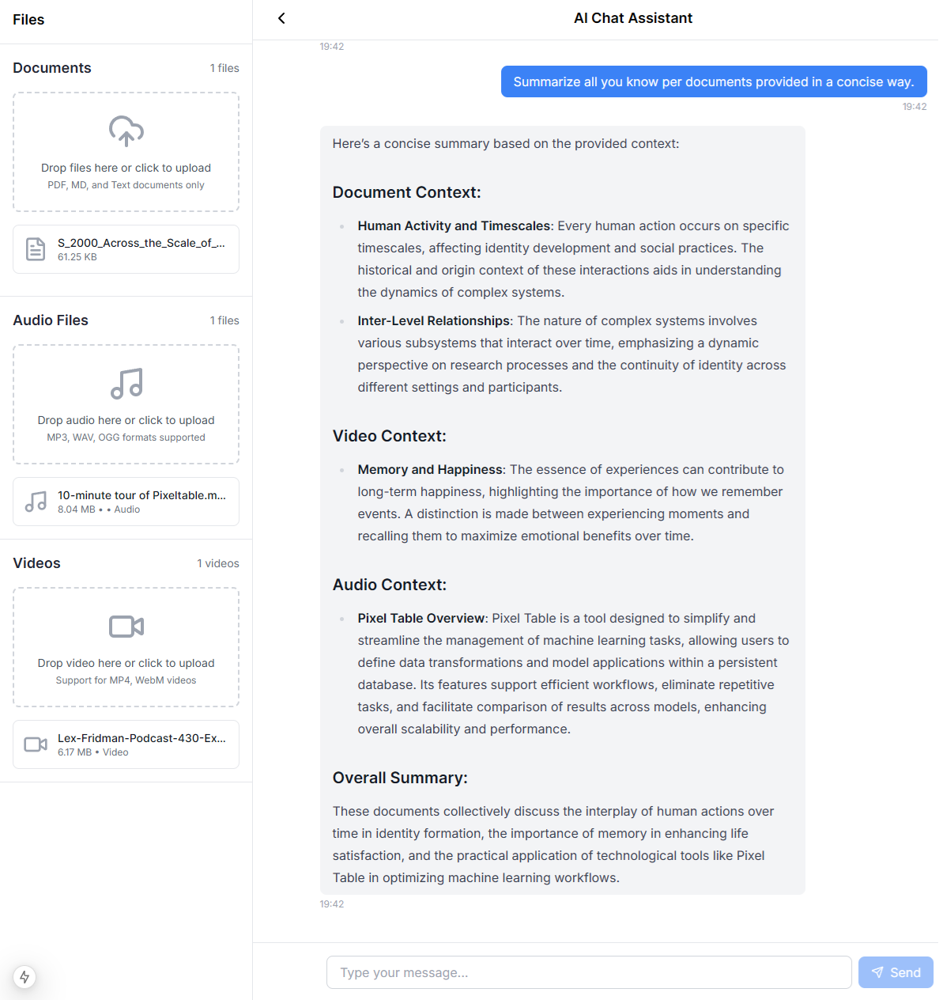
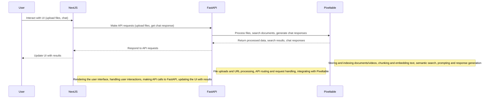

# Local RAG with Multimodal Data

This local RAG application allows users to interact with their documents and videos. Pixeltable also support more [data types and formats](https://docs.pixeltable.com/docs/data-types-and-formats) such as Audio, Image, Int, Float, Array, Timestamp. You could leverage any LLM of your choice. Here we use [OpenAI](https://docs.pixeltable.com/docs/working-with-openai) for the LLM call and transcription but could can also use [Whisper/WhisperX](https://docs.pixeltable.com/docs/whisper) to fully run locally. For instance, Pixeltable supports [Ollama](https://docs.pixeltable.com/docs/working-with-ollama) and [LLama.cpp](https://docs.pixeltable.com/docs/working-with-llamacpp).



## Architecture Overview



- Frontend (Next.js): Responsible for rendering the user interface, handling user interactions, and making API calls to the backend.
- Backend (FastAPI): Handles file uploads, API routing and request processing, and integration with Pixeltable.
- Pixeltable: Manages the storage, indexing, and processing of the multimodal data (documents, videos, audio, etc.), roviding capabilities for semantic search, chunking and embedding, and prompt generation for the chatbot.

## Key Features

- **Multimodal Data Ingestion**: Users can upload a variety of file types, including documents (PDF, Markdown, HTML, Text), videos, and audio. Pixeltable handles the storage, processing, and indexing of this data.
- **Contextual Chatbot**: The chatbot can answer user questions by retrieving relevant information from the uploaded files and generating responses based on the combined context.

## Getting Started

### Prerequisites

- [Node.js](https://nodejs.org/en)
- Python 3.8+
- OpenAI API Key

### Installation

1. **Clone the repository:**

```bash
git clone https://github.com/pixeltable/pixeltable/tree/main/docs/sample-apps/local_multimodal_rag_application.git
cd local_multimodal_rag_application
```

2. **Install frontend dependencies:**

```bash
cd frontend
npm install
```

3. **Install backend dependencies:**

```bash
cd ../backend

# Using pip and requirements.txt
pip install -r requirements.txt

# Alternatively, using Poetry
poetry install

# Or, you can set up and activate a virtual environment, then install dependencies
# Using venv
python -m venv venv
source venv/bin/activate  # On Windows use: venv\Scripts\activate
pip install -r requirements.txt

# Using Pipenv
pip install pipenv
pipenv install
pipenv shell
```

4. **Set up environment variables:**

Update the .env file in the backend directory with your OpenAI API key:

```bash
OPENAI_API_KEY=your_openai_api_key
```

5. **Running the Application**

Start the backend server:

```bash
cd backend
python main.py
```

Start the frontend server:

```bash
cd ../frontend
npm run dev
```

Access the application: Open your browser and navigate to ```http://localhost:3000```.

**Usage**

1. Upload Files: Drag and drop or click to upload documents and videos.
2. Ask Questions: Type your questions in the chat interface and get responses based on the uploaded content.
