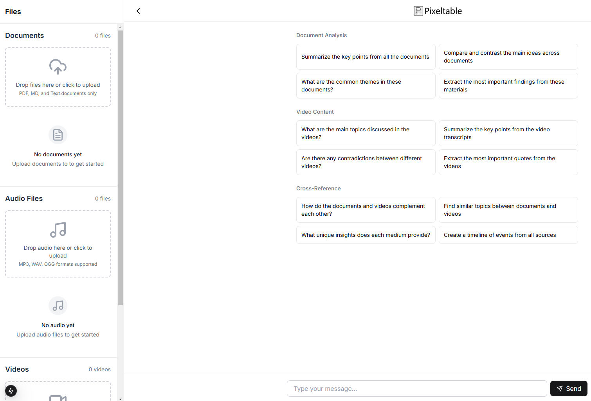
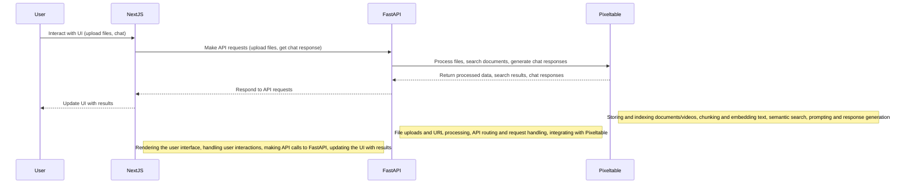

# Multimodal Chat Application

A full-stack application demonstrating Pixeltable's multimodal processing capabilities. This application allows users to interact with documents, videos, and audio files using natural language queries.



## Architecture Overview



## Features

- **Multimodal Data Support**: Process and analyze documents, videos, and audio files
- **Advanced Processing**: Leverages [Pixeltable's data types and formats](https://docs.pixeltable.com/docs/data-types-and-formats)
- **Flexible LLM Integration**: 
  - Default: [OpenAI](https://docs.pixeltable.com/docs/working-with-openai)
  - Alternative options: [Ollama](https://docs.pixeltable.com/docs/working-with-ollama), [LLama.cpp](https://docs.pixeltable.com/docs/working-with-llamacpp)
- **Local Processing Options**: Use [Whisper/WhisperX](https://docs.pixeltable.com/docs/whisper) for local transcription

## Deployment Options

### Local Development

#### Prerequisites
- Python 3.10+
- Node.js 18+
- OpenAI API Key

#### Backend Setup

##### Using Python
```bash
cd backend
uv venv .venv
source .venv/bin/activate  # Windows: .venv\Scripts\activate
uv sync
fastapi dev api/main.py
```

##### Using Docker
```bash
cd backend
docker build -t multimodal-api .
docker run -p 8000:8000 multimodal-api
```

#### Frontend Setup
```bash
cd frontend
npm install
npm run dev
```

### AWS Deployment

See [aws/README.md](aws/README.md) for details.

## Usage

1. Start both backend and frontend servers (or deploy to AWS)
2. Local access: `http://localhost:3000`
3. API documentation: `http://localhost:8000/docs`

## Development Stack

### Backend
- Python 3.10+
- FastAPI for API endpoints
- Dependencies managed with `uv`
- Configuration via environment variables

### Frontend
- Next.js 14
- TypeScript
- Tailwind CSS
- ShadcnUI components

### Infrastructure (AWS)
- AWS CDK (Infrastructure as Code)
- ECS Fargate
- Application Load Balancer
- CloudWatch Monitoring
- AWS Secrets Manager

## Limitations

Current AWS deployment has the following limitations:
- No Session Management: Each request is treated independently
- No Ephemeral Storage Management: Container storage isn't cleaned automatically
- Cost Considerations: Includes billable AWS services (Fargate, NAT Gateway, ALB, CloudWatch)