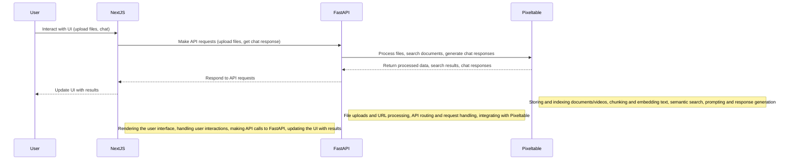

# Multimodal Chat Application

A full-stack application demonstrating Pixel Table's multimodal processing capabilities. This application allows users to interact with documents, videos, and audio files using natural language queries.


## Backend API

### Core Endpoints
- `GET /` - Service info
- `GET /health` - Health check
- `GET /api/files` - List all uploaded files

### File Management
- `POST /api/upload` - Upload document/video files
- `POST /api/videos/upload` - Upload video files
- `POST /api/audio/upload` - Upload audio files
- `GET /api/videos` - List uploaded videos

### Chat Interface
- `POST /api/chat` - Send message and get AI response

## Architecture Overview



## Features

- **Multimodal Data Support**: Process and analyze documents, videos, and audio files
- **Advanced Processing**: Leverages [Pixeltable's data types and formats](https://docs.pixeltable.com/docs/data-types-and-formats)
- **Flexible LLM Integration**: 
  - Default: [OpenAI](https://docs.pixeltable.com/docs/working-with-openai)
  - Alternative options: [Ollama](https://docs.pixeltable.com/docs/working-with-ollama), [LLama.cpp](https://docs.pixeltable.com/docs/working-with-llamacpp)
- **Local Processing Options**: Use [Whisper/WhisperX](https://docs.pixeltable.com/docs/whisper) for local transcription

## Deployment Options

### Local Development

#### Prerequisites
- Python 3.10+
- Node.js 18+
- OpenAI API Key

#### Backend Setup

##### Using Python
```bash
cd backend
uv venv .venv
source .venv/bin/activate  # Windows: .venv\Scripts\activate
uv sync
fastapi dev api/main.py
```

##### Using Docker
```bash
cd backend
docker build -t multimodal-api .
docker run -p 8000:8000 multimodal-api
```

#### Frontend Setup
```bash
cd frontend
npm install
npm run dev
```

### AWS Deployment

The application can be deployed to AWS using CDK, which provisions an ECS Fargate service with auto-scaling, load balancing, and secure secrets management.

#### Prerequisites
- AWS CLI with configured credentials
- AWS CDK v2
- Docker Desktop
- Node.js 18+
- Python 3.8+

#### AWS Infrastructure
- **Compute**: ECS Fargate (ARM64) with 8 vCPU/16GB RAM
- **Scaling**: Auto-scales based on CPU, memory and request count
- **Monitoring**: Container insights and CloudWatch logs
- **Security**: Secrets stored in AWS Secrets Manager
- **Networking**: VPC with public/private subnets and NAT Gateway

#### Deployment Steps
1. Create `.env` file:
```bash
OPENAI_API_KEY=your_key_here
```

2. Install dependencies:
```bash
# Install CDK dependencies
cd aws
npm install

# Install Python dependencies
pip install -r requirements.txt
```

3. Deploy:
```bash
cd aws
cdk bootstrap && cdk deploy
```

#### Cleanup AWS Resources
```bash
cd aws
cdk destroy
```

### Environment Configuration
For local development, create a `.env` file in the backend directory:
```bash
OPENAI_API_KEY=your_openai_api_key
```

## Usage

1. Start both backend and frontend servers (or deploy to AWS)
2. Local access: `http://localhost:3000`
3. API documentation: `http://localhost:8000/docs`

## Development Stack

### Backend
- Python 3.10+
- FastAPI for API endpoints
- Dependencies managed with `uv`
- Configuration via environment variables

### Frontend
- Next.js 14
- TypeScript
- Tailwind CSS
- ShadcnUI components

### Infrastructure (AWS)
- AWS CDK (Infrastructure as Code)
- ECS Fargate
- Application Load Balancer
- CloudWatch Monitoring
- AWS Secrets Manager

## Limitations

Current AWS deployment has the following limitations:
- No Session Management: Each request is treated independently
- No Ephemeral Storage Management: Container storage isn't cleaned automatically
- Cost Considerations: Includes billable AWS services (Fargate, NAT Gateway, ALB, CloudWatch)