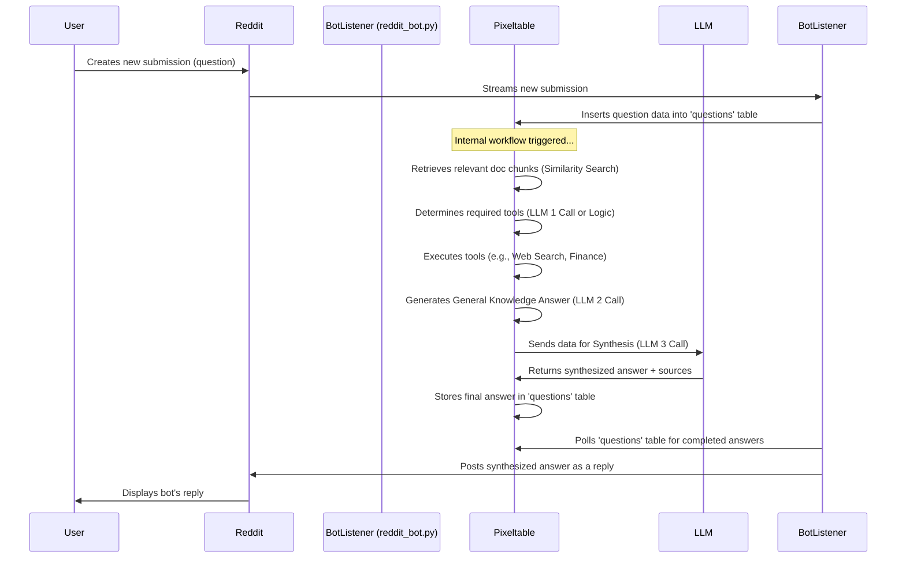

# 🤖 Reddit Agentic/RAG Bot with Pixeltable

A Reddit bot powered by [Pixeltable](https://pixeltable.com/) that automatically answers questions in specified subreddits using Retrieval-Augmented Generation (RAG) and tools. You can see it in action and try it at: https://www.reddit.com/r/Pixeltable/.

## ✨ Core Workflow

The bot utilizes PRAW to monitor new subreddit submissions. Valid questions trigger a Pixeltable workflow:

1.  **📥 Ingestion:** Question details are saved to a Pixeltable table.
2.  **🧠 Pixeltable Pipeline (Automated):**
    *   **Document Retrieval:** Relevant chunks from ingested documents (`config.SOURCE_DATA`) are retrieved via vector similarity search.
    *   **Tool Execution:** Relevant tools (e.g., Web Search via DuckDuckGo, Financial Data via yfinance) are invoked based on the question and context.
    *   **LLM Synthesis:** An LLM (e.g., Claude 3.5 Sonnet) synthesizes a final answer using document context, tool outputs, and optionally its general knowledge, guided by prompts in `config.py`.
    *   **Citation Generation:** Sources used in the synthesis are identified.
3.  **💬 Reddit Reply:** A separate polling thread checks Pixeltable for completed answers and posts them back to the original Reddit submission.



## 🛠️ Prerequisites

*   Python 3.9+ & Pip
*   Running Pixeltable Instance ([Installation Guide](https://pixeltable.com/docs/installation/))
*   Reddit Account & API Credentials:
    *   Go to <https://www.reddit.com/prefs/apps/> and click "create another app...".
    *   **IMPORTANT:** Create the app using the **same Reddit account** that the bot will run as (the one specified for `REDDIT_USERNAME` and `REDDIT_PASSWORD` in your `.env` file).
    *   Select the **"script"** application type. This is **required** for bots authenticating with username/password, as it grants access only to the developer's account (your bot's account).
    *   Fill in a name (e.g., "pixelbot") and description. The "about url" and "redirect uri" fields are not critical for script apps but can be filled (e.g., with your project's GitHub URL or https://pixeltable.com/).
    *   Click "create app".
    *   Note down the **Client ID** (shown under the app name, like `4c-fKQsRxexHICWTX3zDyA`) and the **Client Secret** (labeled "secret").
    *   You will need the Client ID, Client Secret, Reddit Username, and Reddit Password for the `.env` file.
*   LLM API Key (e.g., Anthropic)

## ⚙️ Installation & Setup

1.  **Venv:** `python -m venv venv && source venv/bin/activate` (or `venv\Scripts\activate` on Windows)
2.  **Install:** `pip install -r requirements.txt`
3.  **Configure `.env` and add your credentials.
    ```dotenv
    # Reddit API Credentials (Script App Type)
    REDDIT_CLIENT_ID="YOUR_REDDIT_CLIENT_ID"
    REDDIT_CLIENT_SECRET="YOUR_REDDIT_CLIENT_SECRET"
    REDDIT_USER_AGENT="RAGBot by u/<YourRedditUsername>" # Customize!
    REDDIT_USERNAME="YOUR_REDDIT_USERNAME"
    REDDIT_PASSWORD="YOUR_REDDIT_PASSWORD"

    # LLM API Key
    ANTHROPIC_API_KEY="YOUR_ANTHROPIC_API_KEY"
    ```
6.  **Review `config.py`:** Check models, sources, target subreddit, prompts.
7.  **Setup Pixeltable Data Store and Computation:** `python setup_pixeltable.py` (only once!)
    *   📝 **Note:** This script ingests documents from `config.SOURCE_DATA`, creates embeddings, and builds indexes. It may take several minutes to complete, especially on the first run or with large documents. Performance depends on your CPU/GPU and the embedding model used.

## ▶️ Running the Bot

1.  **Activate venv.** (if not done already)
2.  **Run:** `python reddit_bot.py`
3.  Bot initializes, connects, listens, and polls for replies.
4.  `Ctrl+C` to stop gracefully.

## 📋 Example Console Output

When you run `python reddit_bot.py`, you can expect to see output similar to this, showing initialization, the listener thread, and the reply checking loop:

```text
Starting Reddit Bot (Listener/Reply Mode)...
Initializing Reddit client...
Successfully authenticated as Reddit user: YourBotUsername
Connecting to Pixeltable...
Successfully connected to Pixeltable 'questions' table.
Bot username confirmed: YourBotUsername
Starting listener thread...
--- [Listener Thread] Started listening for submissions in r/YourTargetSubreddit ---
Listener thread started.
Entering main reply check loop (checking every 30 seconds). Press Ctrl+C to stop.

--- Running Reply Check Cycle #1 ---
Cycle #1: Calling check_and_reply...
  -> Entering check_and_reply function...
    Querying Pixeltable for questions to reply to...
    No questions found ready to be replied to.
Cycle #1: Finished check_and_reply.
--- Reply Check Cycle #1 Complete. Sleeping for 30 seconds... ---

(Cycle repeats...)

[Listener Thread] Seen submission: abc123x
[Listener Thread] --> Processing valid new submission: abc123x
[Listener Thread]    Inserting abc123x into Pixeltable...
[Listener Thread]    Insertion successful for abc123x.

--- Running Reply Check Cycle #N ---
Cycle #N: Calling check_and_reply...
  -> Entering check_and_reply function...
    Querying Pixeltable for questions to reply to...
    Found 1 potential questions to reply to. Processing all...
      Processing potential reply for abc123x...
        Fetching submission abc123x to check existing comments...
        Checking comments for abc123x for bot user 'YourBotUsername'...
        Bot has not replied to abc123x yet. Proceeding with reply.
        Posting reply to submission abc123x...
        Successfully replied to abc123x.
        Attempting to update status for abc123x to 'replied'...
        Successfully updated status for abc123x to 'replied'.
      --- Pausing briefly after processing abc123x ---
  -> Exiting check_and_reply function.
Cycle #N: Finished check_and_reply.
--- Reply Check Cycle #N Complete. Sleeping for 30 seconds... ---

(Cycle repeats...)

^C
Ctrl+C detected. Signaling threads to stop...

Main loop finished. Waiting for listener thread to exit (if needed)...
--- [Listener Thread] Exiting ---
Reddit Bot finished.
```

## 📂 File Structure

```
.
├── .env                  # API keys
├── config.py             # Core config (models, prompts, subreddit)
├── functions.py          # Pixeltable UDFs (tools, context formatting)
├── reddit_bot.py         # Main bot script
├── requirements.txt      # Dependencies
├── setup_pixeltable.py   # Pixeltable schema/workflow setup
└── README.md             # This file
```

## 🌱 Future Enhancements

*   **💬 Conversational Follow-ups:** Maintain context for replies to the bot.
*   **🗣️ Mention Trigger:** Summon bot via `u/YourBotName` in comments.
*   **📚 Duplicate Question Detection:** Link to existing answers.
*   **❓ Proactive Clarification:** Ask for details on ambiguous questions.
*   **👍👎 Feedback Loop:** Allow users to rate answers (`!good_answer`).
*   **🌐 Multi-Subreddit / Conditional Logic:** Monitor more subs with varying rules.

See [Pixeltable examples](https://docs.pixeltable.com/docs/examples/use-cases) for different implementations of the above that you can add to this Reddit bot from maintaining short-term and long-term memory to additional interactions.