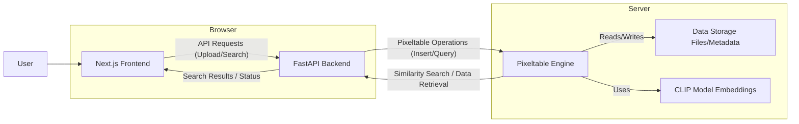

# Multimodal Similarity Search: Video Frames & Tagged Images

<a href="https://github.com/pixeltable/pixeltable"></a>

This application demonstrates building a multimodal similarity search system using [Pixeltable](https://github.com/pixeltable/pixeltable), FastAPI, and Next.js.


**Functionality:**
- **Video Frame Search:** Ingests videos, automatically extracts frames using `FrameIterator`, generates CLIP embeddings, and enables text/image similarity search across frames via an embedding index.
- **Tagged Image Search:** Allows uploading images with multiple tags (stored as `pxt.Json`), generates CLIP embeddings, and supports text/image similarity search.
- **Frontend Interaction:** Provides a React-based UI for uploading, searching, and browsing results grouped by tags.

## Key Pixeltable Concepts Demonstrated

- **Declarative Data Loading:** Defining tables with `pxt.Video` and `pxt.Image` types automatically handles media ingestion.
- **Automated Data Transformation:** Using `FrameIterator` in a `pxt.create_view` call triggers automatic frame extraction upon video insertion.
- **Embedding Index Integration:** `add_embedding_index` automatically computes and indexes embeddings (using OpenAI CLIP via `pixeltable.functions.huggingface.clip`) for new video frames and images.
- **Efficient Similarity Search:** Leveraging the `similarity()` method on indexed image columns for fast, cross-modal (text-to-image, image-to-image) search.
- **Flexible Data Types:** Utilizing `pxt.Json` for storing lists of tags.
- **Direct Image Encoding:** Using `column.b64_encode()` within a `.select()` clause for efficient image formatting for the API.

## 🛠️ Technologies

- **Frontend:**
  - Next.js
  - TypeScript
  - Tailwind CSS
  - React

- **Backend:**
  - FastAPI
  - Pixeltable

## 🏛️ Architecture



## 📦 Installation

### Prerequisites

- Node.js 18+
- Python 3.9+
- pip

### Frontend Setup

```bash
cd docs/sample-apps/text-and-image-similarity-search-nextjs-fastapi/frontend
npm install
npm run dev
```

### Backend Setup

```bash
cd docs/sample-apps/text-and-image-similarity-search-nextjs-fastapi
python -m venv venv
pip install -r requirements.txt
python app.py
```

## 🚀 Deployment

#### Frontend ✅

```
> pixeltable-app@0.1.0 dev
> next dev

   ▲ Next.js 15.0.2
   - Local:        http://localhost:3000

 ✓ Starting...
 ```

#### Backend ✅

```
INFO:     Started server process [53120]
INFO:     Waiting for application startup.
INFO:     Application startup complete.
INFO:     Uvicorn running on http://0.0.0.0:8000 (Press CTRL+C to quit)
```

## 📄 License

This library is licensed under the Apache 2.0 License.
