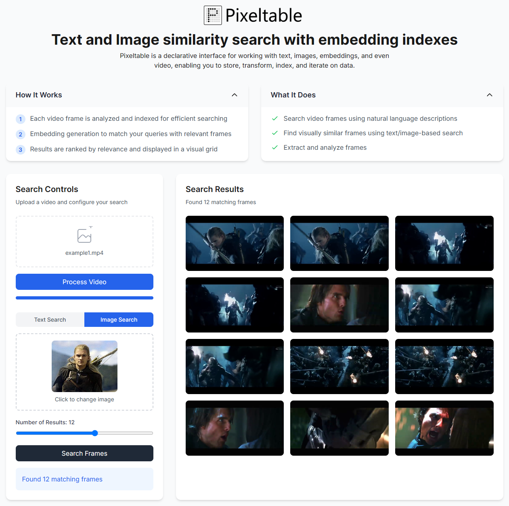

# Text and Image similarity search on video with embedding indexes

## Pixeltable + Next.js + FastAPI Video Frame Search Engine

<a href="https://github.com/pixeltable/pixeltable"></a>

[Pixeltable](https://github.com/pixeltable/pixeltable) is a declarative interface for working with text, images, embeddings, and video, enabling you to store, transform, index, and iterate on data.

This example shows how to  build a video frame search application built with Next.js, FastAPI, and Pixeltable.

Search through video content using text descriptions or similar images.



## 🚀 Features

- Video processing and frame extraction
- Text-based frame search
- Image similarity search
- Responsive UI
- Frame preview gallery

## 🛠️ Technologies

- **Frontend:**
  - Next.js 14
  - TypeScript
  - Tailwind CSS
  - React

- **Backend:**
  - FastAPI
  - Pixeltable

## 📦 Installation

### Prerequisites

- Node.js 18+
- Python 3.9+
- pip

### Frontend Setup

```bash
cd examples/text-and-image-similarity-search-nextjs-fastapi/frontend
npm install
npm run dev
```

### Backend Setup

```bash
cd examples/text-and-image-similarity-search-nextjs-fastapi
python -m venv venv
pip install -r requirements.txt 
python app.py
```

## 🚀 Deployment

#### Frontend ✅

```
> pixeltable-app@0.1.0 dev
> next dev

   ▲ Next.js 15.0.2
   - Local:        http://localhost:3000

 ✓ Starting...
 ```

#### Backend ✅

```
INFO:     Started server process [53120]
INFO:     Waiting for application startup.
INFO:     Application startup complete.
INFO:     Uvicorn running on http://0.0.0.0:8000 (Press CTRL+C to quit)
```

## 📄 License

This library is licensed under the Apache 2.0 License.
